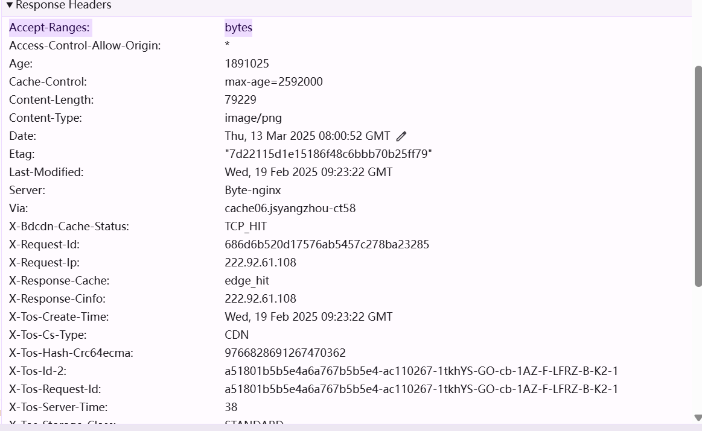

# 1 CDN是什么

CDN（内容分发网络，Content Delivery Network）是一种通过分布式服务器集群，将内容（如网页、视频、图片等）“近距离” 交付给用户的网络优化技术。它的核心逻辑是 **“化整为零，就近服务”**，可以理解为在全国甚至全球部署 “内容便利店”，让用户无需长途跋涉到 “中央仓库”（源服务器）取货。

## 1.1 🔍 **CDN 的工作原理（通俗版）**


1. **内容 “铺货”**：网站将内容提前复制到分布在各地的 CDN 节点（类似缓存服务器）。
2. **智能 “指路”**：用户访问时，CDN 根据地理位置、网络质量等，自动分配最近的节点提供服务。
3. **实时 “补货”**：节点内容过期或更新时，自动从源站同步最新内容。

  

**举个栗子**：苏州用户看北京的短视频，传统方式需从北京服务器传输（可能卡顿）；通过 CDN，上海 / 南京的节点已缓存视频，用户直接秒加载。

## 1.2 🌟 **为什么要用 CDN？4 大核心价值**

1. **快！快！快！**
    
    - **提升加载速度**：减少数据传输距离，延迟降低 50%-80%（比如网页打开从 5 秒→1 秒）。
    - **典型场景**：电商大促（避免首页崩溃）、直播 / 短视频（卡顿率下降）、游戏更新（分片下载加速）。
2. **帮源站 “减压”**
    - 90% 以上的请求由 CDN 节点处理，源服务器只需应对动态内容和缓存更新，节省带宽成本 30%-70%。
    - **案例**：某新闻网站启用 CDN 后，源站带宽从 10G 降至 3G，服务器成本大幅降低。
3. **稳定抗 “黑天鹅”**
    - **高可用性**：单个节点故障时，自动切换其他节点，避免全站瘫痪。
    - **抗攻击**：CDN 节点分布式架构可稀释 DDoS 攻击流量，比源站直接暴露更安全。
4. **覆盖 “最后一公里”**
    - 尤其针对复杂网络环境（如乡镇、海外），CDN 通过接入电信、联通、移动等多运营商节点，打破网络壁垒。
    - **数据**：中国 CDN 节点已超 2000 个，乡镇覆盖率超 95%，海外节点覆盖主要国家。

## 1.3 📢 **一句话总结**

CDN 是互联网的 “前置仓库”，用 “物理距离缩短 + 智能调度” 解决用户体验的核心痛点 ——**让内容更快、更稳、更省**。无论是刷短视频、抢火车票，还是企业降本增效，CDN 都是底层的 “隐形功臣”。

（2025 年的今天，CDN 已深度融入 AI 模型推理加速、元宇宙场景渲染等新领域，成为数字世界的基础设施之一～）


# 2 域名是否开启CDN

## 2.1 快速判断是否开启 CDN

### 2.1.1  **DNS 解析法（核心判断）**

- **操作**：`nslookup 域名`（Windows）或`dig 域名`（Mac/Linux）
- **特征**：  
    ✅ 开启 CDN：解析出多个不同 IP（如 119.8.xxx/101.226.xxx 等跨地域段），或域名含 CDN 服务商特征（如`*.cdn.dnsv1.com`→腾讯云，`*.edgekey.net`→Akamai）。  
    ❌ 未开启：仅 1 个 IP，且归属地与网站主服务器一致（如苏州网站解析到北京 IP 可能异常）。
- **案例**：`nslookup www.bilibili.com` → 解析出多个上海 / 广州 / 香港 IP（B 站用腾讯云 + 阿里云混合 CDN）。


下面列表给出了一些CDN服务商的域名特征（SLD）：
- https://cdn.jsdelivr.net/gh/4ft35t/cdn/src/cdn.yml
- https://raw.githubusercontent.com/4ft35t/cdn/master/src/cdn.yml
- https://raw.githubusercontent.com/SukkaLab/cdn/master/src/cdn.yml

CNAME是CDN的一个强有力指纹。因为**CDN 强制要求**：

>几乎所有 CDN 服务商（如阿里云、腾讯云、Cloudflare）都会要求用户将域名**CNAME 到其专属加速域名**（如`www.example.com → www.example.com.cdn.dnsv1.com`（腾讯云））。这是因为CDN 需要通过自有域名调度全球节点，CNAME 是必经路径。


同时**CNAME 的 “间接指向” 特性**，CNAME 不直接解析 IP，而是指向另一个域名（如 CDN 节点域名），最终由该域名的 A 记录解析到 IP。因此，若域名存在**非用户自有的 CNAME 后缀**（如含`cdn`、`edge`、`cloudflare`等关键词），基本可判定为 CDN。示例：  `nslookup www.taobao.com` → 解析结果为`www.taobao.com.cdn.aliyuncs.com`（CNAME），再进一步解析该 CNAME 得到多个阿里云 IP 段，确认 CDN。


注意：

1. 解析 CNAME 后的域名，通过[IPIP.NET](https://www.ipip.net/)查询 IP 归属，若匹配 CDN 厂商（如阿里云、腾讯云），确认 CDN。
2. 阿里云 SLB、腾讯云 CLB 等负载均衡服务也会生成 CNAME（如`lb-xxx.cnslb.com`），但 IP 通常集中在单一云厂商地域，而非 CDN 的全球节点。（云服务负载均衡）


### 2.1.2 **PING 多节点法（辅助验证）**

- **工具**：[站长工具 - 超级 PING](https://ping.chinaz.com/)（选全国 10 + 城市节点）
- **特征**：  
    ✅ 开启 CDN：不同城市 PING 值差异小（如均 < 50ms），IP 归属地分散（覆盖电信 / 联通 / 移动）。  
    ❌ 未开启：异地 PING 值飙升（如苏州→乌鲁木齐延迟 300ms+），IP 集中在单一地区。

同时可以用来辅助DNS指纹的CNAME 解析IP判断。

### 2.1.3 **HTTP 头信息（精准验证）**

- **操作**：浏览器 F12→Network→刷新页面→选任意资源→查看 Response Headers
- **关键字段**：  
    ✅ `X-Cache`：值为`HIT`（CDN 缓存命中），`MISS`（回源）  
    ✅ `Server`：含 CDN 服务商名（如`TencentCdn`→腾讯云，`cloudflare`→Cloudflare）
- **案例**：淘宝图片`img.alicdn.com`的 Header 含`AliyunCDN`，确认使用阿里云 CDN。

示例：


|字段名|值|解读（CDN 相关）|
|---|---|---|
|**`x-tos-cs-type`**|**CDN**|直接声明使用**内容分发网络**（TOS：字节跳动对象存储，全称为 Toutiao Object Storage）|
|**`x-response-cache`**|**edge_hit**|内容从**CDN 边缘节点**命中，非源站回源（证明 CDN 生效）|
|**`age`**|1891025（约 22 天）|缓存存活时间，CDN 典型长缓存策略（源站`cache-control: max-age=2592000`=30 天）|
|**`via`**|cache06.jsyangzhou-ct58|CDN 节点标识：江苏扬州（jsyangzhou）电信（ct）第 58 号节点（符合分布式部署特征）|
|**`server`**|**Byte-nginx**|字节跳动自研 Web 服务器（区别于通用 nginx），**强指向字节系 CDN**（如字节云 CDN）|


## 2.2 定位 CDN 服务商（3 步溯源）

### 2.2.1  **IP 反查法（最直接）**  

- **工具**：[IPIP.NET](https://www.ipip.net/)（推荐）、[Censys](https://censys.io/)（需技术基础）
- **操作**：  
    ① 获取域名解析 IP（如`dig +short www.taobao.com`）  
    ② 逐个查询 IP 归属：  
    ▶ 101.226.xxx → 阿里云（中国内地主力段）  
    ▶ 119.28.xxx → 腾讯云（常见 CDN 段）  
    ▶ 180.163.xxx → 百度云（百度系专属段）
- **2025 新趋势**：部分 CDN 隐藏真实 IP（如 Cloudflare 的 Argo 隧道），需结合 DNS 指纹判断。


### 2.2.2 **DNS 指纹识别（进阶）**

同CNAME一致，[[CDN 判断#**DNS 解析法（核心判断）**]]
 
 **特征域名后缀**：
    
| 服务商        | 特征后缀                                                                            | 案例                                                                                |
| ---------- | ------------------------------------------------------------------------------- | --------------------------------------------------------------------------------- |
| 阿里云        | *.[alicdn.com](https://alicdn.com/)                                             | [img.alicdn.com](https://img.alicdn.com/)                                         |
| 腾讯云        | *.[cdn.dnsv1.com](https://cdn.dnsv1.com/)                                       | [cdn-1253793123.cdn.dnsv1.com](https://cdn-1253793123.cdn.dnsv1.com/)             |
| Cloudflare | _.[cf.net/](https://cf.net/)_.[cdn.cloudflare.net](https://cdn.cloudflare.net/) | [cdn.example.com.cdn.cloudflare.net](https://cdn.example.com.cdn.cloudflare.net/) |
| 华为云        | *.[myhuaweicloud.com](https://myhuaweicloud.com/)                               | [static.myhuaweicloud.com](https://static.myhuaweicloud.com/)                     |
    

### 2.2.3 **在线工具集**

  
- **[CDN 雷达](https://www.cdnradar.com/)**：输入域名自动识别服务商、节点分布（需注册）
- **[WhatCDN](https://whatcdn.org/)**：通过 JS 指纹识别（对 Cloudflare、Akamai 精准）
- **2025 新工具**：[EdgeDB](https://edgedb.com/)（基于全球 10 万 + 节点探测，支持 AI 识别多云 CDN）


## 2.3 一些特殊场景处理

  

1. **子域名差异化 CDN**  
    主站（www）用 A 服务商，图片（img）用 B 服务商（如抖音主站腾讯云，CDN 图片用字节云）。需分别解析子域名。
    
2. **CDN 隐藏真实 IP**
    
    - 场景：源站 IP 被 CDN 完全隐藏（如 Cloudflare 的 Full SSL）
    - 破解：找未被 CDN 覆盖的资源（如`robots.txt`、管理后台路径），直接 PING 获取源 IP。
3. **多云 CDN（2025 主流）**
    
    - 特征：解析出多服务商 IP 段（如阿里云 + 腾讯云混合）
    - 判断：通过 IP 反查组合结果，或用[CDNView](https://cdnview.com/)可视化节点归属。


## 2.4 注意事项

- ❗ **误判场景**：  
    ① 大站自建 CDN（如字节跳动、美团），IP 段可能无服务商标识  
    ② 动态内容（如 API 接口）未走 CDN，需验证静态资源（JS/CSS/ 图片）
- 💡 **经验口诀**：  
    “解析多 IP，PING 值稳，头含服务商，IP 段对号 —— 四者一致可确诊。”


示例：判断`www.suzhou.gov.cn`是否用 CDN
  

1. `nslookup`解析→3 个 IP：114.215.xxx（江苏电信）、180.163.xxx（百度云）、47.93.xxx（阿里云）
2. 超级 PING→全国节点延迟均 < 30ms，IP 覆盖江苏 / 北京 / 杭州
3. HTTP 头→`X-Cache: HIT from BDCDN`（百度云 CDN 标识）  
    **结论**：开启 CDN，服务商为百度云 + 阿里云（政务云常见混合部署）。


通过以上方法，90% 以上的 CDN 均可精准识别。复杂场景建议结合 2-3 种工具交叉验证～


# 3 IP是否是CDN


## 3.1 IP归属

通过一些商用API，会收集一些互联IP的资产归属，运营商或者用途。下面是工具示例，只是参考：

| 方法           | 操作步骤                                          | 工具 / 数据来源                                                                             | 示例（部分 CDN IP 段）                               | 注意事项                  |
| ------------ | --------------------------------------------- | ------------------------------------------------------------------------------------- | --------------------------------------------- | --------------------- |
| **IP 库查询**   | 输入 IP，查看 “运营商” 或 “用途” 字段                      | IP2Location、[IPIP.net](https://ipip.net/)、IPinfo.io                                   | 阿里云：118.178.0.0/16  <br>腾讯云：119.29.0.0/16     | 需付费库获取精准 CDN 标识       |
| **WHOIS 查询** | 解析 IP 的注册信息，看是否含 “CDN”“Content Delivery” 等关键词 | [whois.arin.net](https://whois.arin.net/)、[whois.apnic.net](https://whois.apnic.net/) | 百度云 IP：WHOIS 含 “Beijing Baidu Netcom Science” | 部分 IP 归属云厂商（非 CDN）需排除 |


## 分地PING/TRACERT

CDN 节点覆盖全球，同一 IP 若在多地 PING 返回不同地理位置，或 TRACERT 显示 CDN 服务商 AS 号，可判定为 CDN。


| 方法               | 操作步骤                                                         | 工具 / 数据来源                                 | 示例现象                                | 注意事项                      |
| ---------------- | ------------------------------------------------------------ | ----------------------------------------- | ----------------------------------- | ------------------------- |
| **多地 PING**      | 用工具（如[Cloudping](https://www.cloudping.co/)）从不同地区 PING 目标 IP | Cloudping、站长工具 - 超级 PING                  | 北京 Ping 返回河北 IP，上海 Ping 返回江苏 IP     | 需排除动态 IP 或 BGP 多线机房       |
| **TRACERT 路由追踪** | 执行`tracert IP`，看最后几跳跃点是否含 CDN 服务商名称或 AS 号                    | 系统命令行（Windows: tracert，Linux: traceroute） | 路由末端显示`aliyun-cdn.com`或 AS9009（阿里云） | 部分 CDN 节点隐藏真实 IP（需结合其他方法） |


## 响应头

CDN 节点的 HTTP 响应头常含专属字段（即使通过 IP 直接访问）。

```bash
curl -I http://{IP}/index.html  # 替换为实际可访问路径
# 若返回`X-Tengine`（阿里云）或`Server: yunjiasu-nginx`（又拍云），判定为CDN
```

参考上文示例。

