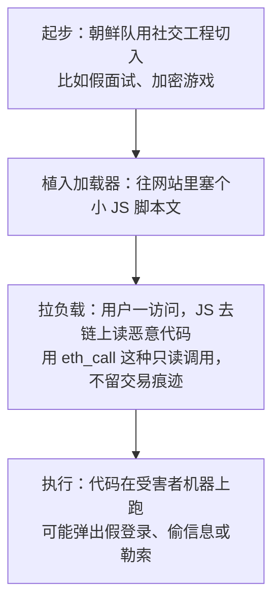
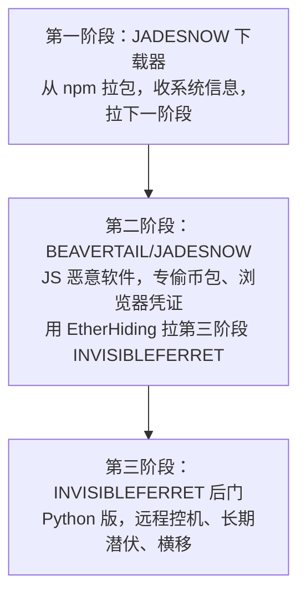
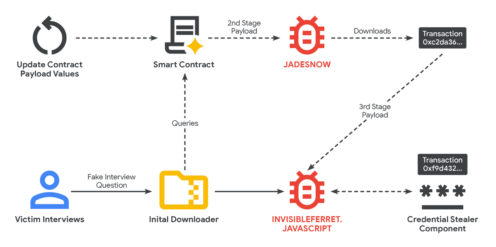
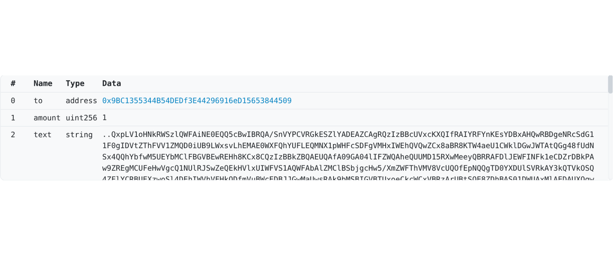
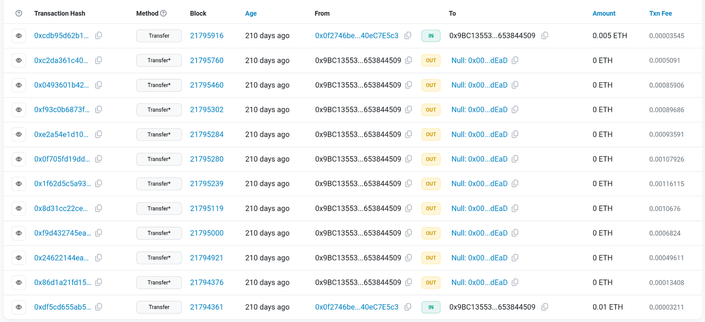
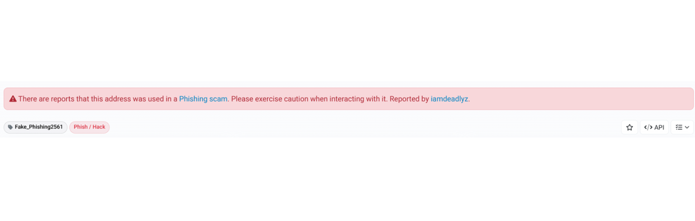

Google 威胁情报组发现朝鲜威胁组织 UNC5342 开始用 EtherHiding 来发恶意软件、偷加密货币。这是我们第一次看到国家队用这招。本文会详细分析这个技术和事件。

EtherHiding 是从2023年9月开始冒头的技巧，之前在 CLEARFAKE 活动（UNC5142）里用过，主要靠假浏览器更新弹窗骗用户跑恶意代码。现在朝鲜也拿来用了。

从2025年2月起，我跟踪 UNC5342 把这招加进他们的“Contagious Interview”社交工程活动里。用 JADESNOW 恶意软件部署 INVISIBLEFERRET 的 JS 版，已经搞出好几起加密货币大盗案。

## EtherHiding 怎么玩的

简单说，就是把恶意代码（通常是 JS）塞进 BNB Smart Chain 或 Ethereum 这种公共链的智能合约里。区块链就成了他们的 C2 服务器，又去中心化又抗打。这种方法本质上将区块链转变为去中心化和高度弹性的命令与控制 (C2) 服务器。

攻击流程是这样的：



## 为什么攻击者爱用

- **抗封杀**：链上存代码，没中央服务器，执法和安全公司拿它没辙。
- **匿名**：交易伪匿名，难追人。
- **不变**：合约一部署，除非自己改，谁都动不了。
- **隐蔽**：只读调用不产生交易，踪迹少。
- **灵活**：随时更新合约，就能换攻击方式、域名或恶意软件。

这招本质上是把区块链当防弹主机用，威胁在不断进化。

## 朝鲜的社交工程套路

朝鲜的社交工程活动是一项复杂且持续的网络间谍和财务动机行动，巧妙地利用求职和面试流程。该活动针对开发人员，特别是加密货币和技术领域的开发人员，以窃取敏感数据、加密货币，并获得公司网络的持久访问权限。

### 钓鱼起步

- 在 LinkedIn、招聘网站上建假招聘资料，冒充大厂。
- 甚至搞假公司网站和社交账号，比如 BlockNovas LLC、Angeloper Agency。
- 主动联系开发者，抛诱人职位。

### 面试陷阱

- 聊到 Telegram 或 Discord。
- 技术测试时，让下载 GitHub 文件——里面藏恶意代码。
- 或者视频面试时弹假错误，骗下载“修复工具”。

### 感染链

多阶段，跨 Windows/macOS/Linux。



## JADESNOW 详解

JADESNOW 是与威胁集群 UNC5342 相关的 JavaScript 基础下载器恶意软件家族。JADESNOW 利用 EtherHiding 从 BNB Smart Chain 和 Ethereum 上的智能合约中获取、解密和执行恶意负载。智能合约中存储的输入数据可能采用 Base64 编码和 XOR 加密。JADESNOW 感染链的最终负载通常是更持久的后门，如 INVISIBLEFERRET.JAVASCRIPT。

ADESNOW 的部署和管理与实施 EtherHiding 的类似活动（如 CLEARFAKE）不同。CLEARFAKE 活动与威胁集群 UNC5142 相关，作为恶意 JavaScript 框架，通常伪装成 Google Chrome 浏览器更新弹出窗口出现在被入侵网站上。嵌入的 JavaScript 的主要功能是在用户点击“更新 Chrome”按钮后下载负载。第二阶段负载是存储在 BNB Smart Chain 上的另一个 Base64 编码 JavaScript。最终负载可能与合法更新捆绑其他文件，如图像或配置文件，但恶意软件本身通常是信息窃取器如 LUMASTEALER。

朝鲜这边的链更复杂：第一阶段 JS 拉第二阶段 JADESNOW，从 BNB 合约读；JADESNOW 再从 Ethereum 拉第三阶段。还跨链切换，分析更加困难。



## 恶意合约分析

BNB Smart Chain 和 Ethereum 都设计用于运行去中心化应用 (dApps) 和智能合约。智能合约是区块链上的代码，当满足特定条件或协议时自动执行操作，实现无需中介的安全、透明和自动化协议。智能合约被编译成字节码并上传到区块链，使其公开可用以供分析。

BNB Smart Chain 与 Ethereum 类似，是支持为 Ethereum 虚拟机 (EVM) 编程的智能合约的去中心化和无许可区块链网络。虽然智能合约为构建去中心化应用提供了创新方式，但其不可更改性质被 EtherHiding 利用，以托管和提供无法轻易阻止的恶意代码。

UNC5342 用集中 API（如 Binplorer）查链，不直接 RPC。合约地址：`0x8eac3198dd72f3e07108c4c7cff43108ad48a71c`。

前四个月更新20+次，每次才1.37刀 gas。这合约还牵扯2025年6月 React Native 的 npm 供应链攻击。

```json
{
    "timestamp": 1738949853,
    "transactionHash": "0x5c77567fcf00c317b8156df8e00838105f16fdd4fbbc6cd83d624225397d8856",
    "tokenInfo": {
        "address": "0x8eac3198dd72f3e07108c4c7cff43108ad48a71c",
        "owner": "0x9bc1355344b54dedf3e44296916ed15653844509",
        "txsCount": 22
    }
}
```

用 BscScan/Etherscan 看交易，Data 里是 Base64+XOR 的 JS——第二阶段 JADESNOW。



JADESNOW 跑内存，解出 API 调用 Ethereum 交易（发到死地址 0x00…dEaD，当死信箱）。多浏览器查（Blockchair 等），用免费 key 防封。



## 负载拆解

第三阶段 INVISIBLEFERRET.JS，在 tx `0x86d1a21fd151e344ccc0778fd018c281db9d40b6ccd4bdd3588cb40fade1a33a`。

此有效负载通过端口 3306（MySQL 的默认端口）连接到 C2 服务器。它发送一个初始信标，其中包含受害者的主机名、用户名、作系统以及当前运行后门的目录。后门继续在后台运行，侦听传入的命令到 C2。命令处理程序能够处理任意命令执行，执行内置命令以更改目录，以及从受害者的系统中窃取文件、目录和子目录。

JAVASCRIPT 有效负载也可以拆分为不同的组件，就像在交易地址[ `0xc2da361c40279a4f2f84448791377652f2bf41f06d18f19941a96c720228cd0f` ](https://etherscan.io/tx/0xc2da361c40279a4f2f84448791377652f2bf41f06d18f19941a96c720228cd0f)上完成一样 。拆分的 JavaScript 有效负载执行 INVISIBLEFERRET。JAVASCRIPT 后门并尝试安装可移植的 Python 解释器以执行存储在交易地址[`0xf9d432745ea15dbc00ff319417af3763f72fcf8a4debedbfceeef4246847ce41` ](https://etherscan.io/tx/0xf9d432745ea15dbc00ff319417af3763f72fcf8a4debedbfceeef4246847ce41)中的附加凭据窃取组件 。这个额外的凭据窃取程序组件针对 Google Chrome 和 Microsoft Edge 等 Web 浏览器，以窃取存储的密码、会话 cookie 和信用卡。 隐形雪貂。JAVASCRIPT 凭据窃取程序组件还针对 MetaMask 和 Phantom 等加密货币钱包，以及来自密码管理器（例如 1Password）等其他敏感应用程序的凭据。数据被压缩成 ZIP 存档并上传到攻击者控制的远程服务器和私人 Telegram 聊天。


## 集中依赖的弱点

去中心化是区块链网络和其他 Web3 技术的核心原则。然而，在实践中，经常使用集中式服务，这既带来了机会，也带来了风险。尽管像 BNB 智能链这样的区块链是不可变且无需许可的，并且部署在此类区块链上的智能合约无法删除，但使用这些区块链的威胁行为者并非不可阻挡。

朝鲜的 UNC5342 和威胁行为者 UNC5142 在从智能合约检索信息时都没有直接与 BNB 智能链交互;这两个威胁行为者都在使用集中式服务，类似于使用传统的 Web2 服务，例如网络托管。这为精明的防御者提供了减轻此类威胁的机会。这些中心化中介机构代表观察和控制点，可以通过阻止、暂停帐户或其他方法监控流量并解决恶意活动。换句话说，UNC5142 和 UNC5342 正在使用许可服务与无需许可的区块链进行交互。

链是去中心的，但他们用集中 API 中介——这就是切口。UNC5342 用 API，UNC5142 用 RPC，都不是跑全节点（太费资源易追踪）。


## 防护建议

传统封域名/IP 不管用，合约关不了。



用云管理，集中控浏览器，断攻击链。

1. **封下载**：DownloadRestrictions 挡 .exe/.msi/.bat/.dll。
2. **管更新**：自动后台推，用户训：绝不手动更，弹窗必骗。
3. **控访问**：URLBlocklist 封恶意域；Safe Browsing 增强模式。

## IoC

| 类型          | 指标                                                         | 说明               |
| ------------- | ------------------------------------------------------------ | ------------------ |
| SHA256 (ZIP)  | `970307708071c01d32ef542a49099571852846a980d6e8eb164d2578147a1628` | JADESNOW ZIP       |
| SHA256 (JS)   | `01fd153bfb4be440dd46cea7bebe8eb61b1897596523f6f6d1a507a708b17cc7` | 启动链条           |
| BSC 合约      | `0x8eac3198dd72f3e07108c4c7cff43108ad48a71c`                 | 第二阶段           |
| BSC 主人      | `0x9bc1355344b54dedf3e44296916ed15653844509`                 | 控制地址           |
| ETH tx (后门) | `0x86d1a21fd151e344ccc0778fd018c281db9d40b6ccd4bdd3588cb40fade1a33a` | INVISIBLEFERRET.JS |
| ETH tx (拆分) | `0xc2da361c40279a4f2f84448791377652f2bf41f06d18f19941a96c720228cd0f` | 拆分版             |
| ETH tx (偷凭) | `0xf9d432745ea15dbc00ff319417af3763f72fcf8a4debedbfceeef4246847ce41` | 凭证偷取           |

## YARA 规则

```yara
rule G_Downloader_JADESNOW_1 {
    meta:
        author = "Google Threat Intelligence Group"
    strings:
        $s1 = "global['_V']"
        $s2 = "global['r']"
        $s3 = "umP"
        $s4 = "mergeConfig"
        $s5 = "charAt" nocase
    condition:
        uint16(0) != 0x5A4D and filesize < 10KB and #s3 > 2 and #s5 == 1 and all of them
}
```

