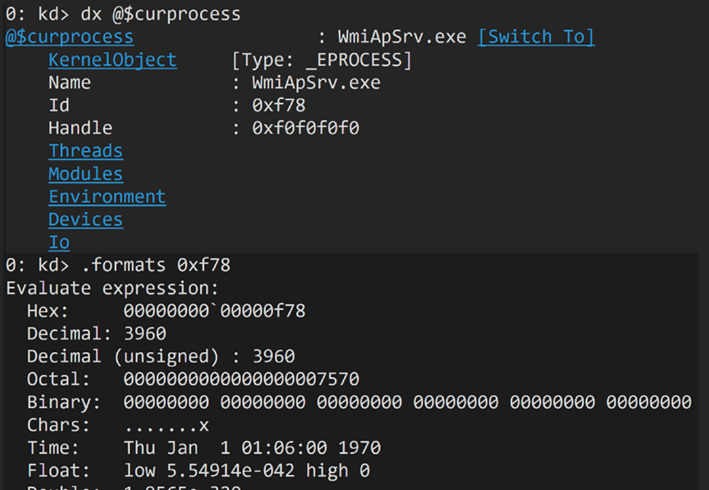

## 1. 基础内核调试命令

| 命令 | 作用 |
| --- | --- |
| `.logfile` | 查看是否已设置日志文件 |
| `.logappend <完整路径>` | 新建或追加日志文件，示例：`.logappend c:\\\\kernel-logs.log` |
| `g` | 继续运行目标机，直到下一次中断 |
| `.process` | 回到默认内核进程上下文 |

## 2. 日志与调试器会话

### 查看当前会话

```
dx Debugger.Sessions
```

- 通常 `Session 0` 是当前会话。
- 如果只看到一个 PID 为 0 的“Unknown Image”，说明目标机还在启动，请多按几次 `g`。直到系统完成启动。

### 按进程名过滤

```
dx Debugger.Sessions.First().Processes.Flatten(p => p.Name).Where(p => p.Name == "MsMpEng.exe")

```

### 切换到指定进程

```
dx Debugger.Sessions[0].Processes[3960].SwitchTo()

```

验证是否切换成功：

```
dx @$curprocess 

```



使用 **`!dml_proc`** 命令后点击可用的地址来切换。切换后可用 **`@$curprocess`** 验证。

```
!dml_proc

```

输出结果中，`lsass.exe` 的地址可点击，随后点击 “select user mode state” 即可进入用户态上下文。

---

## 3. 用户态进程上下文切换

| 场景 | 指令 |
| --- | --- |
| 列出用户态模块 | `lmuD` |
| 查看指定模块详情 | `lm vm kernelbase` |
| 列出导出函数 | `x /f /D kernelbase!createt*` |
| 设置断点 | `bp msmpeng!<函数名>` `bp kernel32!CreateFileA` |
| 列出断点 | `bl` |
| 清除断点 | `bc <编号>` |

---

## 4. PEB（进程环境块）探索

在进程上下文中：

```
dx @$peb

```

查看 `PEB_LDR_DATA`：

```
dx ((ntdll!_PEB_LDR_DATA*)@$peb->Ldr)

```

---

## 5. 符号配置（离线/在线）

### 离线环境所需工具

- `Symstore.exe`
- `Symchk.exe`
- `Symsrv.dll`
- `SymbolCheck.dll`
- `Dbgeng.dll`
- `Dbghelp.dll`

### 步骤 1：生成清单文件

```bash
mkdir c:\\path\\to\\empty\\folder
symchk /om myManifest.txt /ie ntoskrnl.exe /s c:\\path\\to\\empty\\folder

```

### 步骤 2：联网机器下载符号

```bash
symchk /im myManifest.txt /s SRV*C:\\symbols*<http://msdl.microsoft.com/download/symbols>

```

### 步骤 3：一次性缓存所有 DLL/EXE 符号

```bash
symstore add /r /f c:\\windows\\*.dll  /s c:\\symbols /t "Microsoft Windows" /v ""
symstore add /r /f c:\\windows\\*.exe  /s c:\\symbols /t "Microsoft Windows" /v ""
symchk  /r c:\\windows\\*.dll /s SRV*C:\\symbols*<http://msdl.microsoft.com/download/symbols>
symchk  /r c:\\windows\\*.exe /s SRV*C:\\symbols*<http://msdl.microsoft.com/download/symbols>

```

### 内核结构参考资源

- [Vergilius Project](https://www.vergiliusproject.com/)
- [ReactOS PEB 文档](https://doxygen.reactos.org/d0/d53/struct__PEB.html)
- [Geoff Chappell 研究](https://www.geoffchappell.com/studies/windows/km/ntoskrnl/inc/api/pebteb/peb/index.htm)

---

## 6. 远程内核调试：两台虚拟机互联

### 必备清单

- 两台处于同一网络的 Windows VM
- Windows 10 SDK（调试机）
- WinDbg（调试机）

### 步骤概览

| 步骤 | 调试机（Debugger） | 被调试机（Debuggee） |
| --- | --- | --- |
| 1 | 安装 WinDbg & SDK | 复制 `kdnet.exe` 与 `VerifiedNICList.xml` 到 `C:\\KDNET` |
| 2 | 打开 WinDbg → Attach to kernel | 管理员 CMD：`kdnet.exe <调试机IP> <端口>` |
| 3 | 输入 kdnet 生成的 key | 重启 |
| 4 | 连接成功 | — |


## 7. 64 位系统调用（Syscall）

- 入口：`ntdll.dll`（GUI 线程还会调用 `win32u.dll`）
- 本质：从用户态切换到内核态，创建系统对象或执行特权操作。

---

## 8. 编译器内建函数（Intrinsic）

| 目的 | 64 位 | 32 位 |
| --- | --- | --- |
| 获取 PEB | `__readgsqword(FIELD_OFFSET(TEB, ProcessEnvironmentBlock))` | `__readfsdword(...)` |
| 获取进程 ID | `__readgsqword(FIELD_OFFSET(TEB, ClientID))` | `__readfsdword(...)` |
| 获取返回地址 | `__AddressOfReturnAddress()` | 同上 |
| 字节序转换 | `__byteswap_ushort(PORT)` `__byteswap_ulong(IP_HEX)` | 同上 |

常用内建函数：`memset`, `memcmp`, `memcpy`, `strcat`, `strcpy` 等。

---

## 9. 位置无关代码（PIC/PIF）

- **PIC(Position Independent Code)**：整个程序无绝对地址，方便做 shellcode。
- **PIF(Position Independent Function)**：仅让单个函数或 C++ 类无外部引用，可提取为 shellcode。

---

## 10. 系统调用桩（Syscall Stub）

### 通用模板

```nasm
mov r10, rcx        ; 4c 8b d1
mov eax, <SyscallID>
test byte ptr [7FFE0308h], 1
jne  use_int2e
syscall
ret
use_int2e:
int 2Eh
ret

```

### 实例：NtAccessCheck（SyscallID=0）

```nasm
00007fff`6c18cd30 4c8bd1  mov r10, rcx
00007fff`6c18cd33 b800000000  mov eax, 0
00007fff`6c18cd38 f604250803fe7f01  test byte ptr [7FFE0308h], 1
00007fff`6c18cd40 7503  jne ...
00007fff`6c18cd42 0f05  syscall
00007fff`6c18cd44 c3  ret

```

### Hook 后的 NtCreateProcess

```nasm
jmp  <HookAddr>
int3 int3 int3       ; 保持对齐
...

```

---

## 11. 函数 Hook 技术

### 32 位示例

- 原函数：前 5 字节 `mov edi, edi` + `push ebp ...`
- Hook 后：`jmp <HookAddr>` + `push 0`

### 64 位示例

- 原函数：`mov r11, rsp` + `sub rsp, 68h`
- Hook 后：`jmp <HookAddr>` + `int3` 对齐

---

## 12. 实战代码示例

### 1) Intrinsic Hasher（基于 SSE2 的 Unicode 字符串哈希）

```cpp
DWORD IntrinsicHasher(const PUNICODE_STRING String) {
    DWORD dwHash = 0;
    __m128i hash = _mm_setzero_si128();
    DWORD length = String->Length / sizeof(WCHAR);
    DWORD i = 0;

    for (; i + 8 <= length; i += 8) {
        __m128i chunk = _mm_loadu_si128((__m128i*)&String->Buffer[i]);
        hash = _mm_xor_si128(hash, chunk);
    }

    DWORD dwParts[4];
    _mm_storeu_si128((__m128i*)dwParts, hash);
    dwHash = dwParts[0] ^ dwParts[1] ^ dwParts[2] ^ dwParts[3];

    for (; i < length; ++i)
        dwHash ^= String->Buffer[i];

    return dwHash;
}

```

### 2) Intrinsic UNICODE_STRING 比较

```cpp
BOOLEAN CompareUnicodeString(const PUNICODE_STRING s1,
                             const PUNICODE_STRING s2) {
    if (s1->Length != s2->Length) return FALSE;
    USHORT len = s1->Length / sizeof(WCHAR);
    USHORT i = 0;

    for (; i + 8 <= len; i += 8) {
        __m128i a = _mm_loadu_si128((__m128i*)&s1->Buffer[i]);
        __m128i b = _mm_loadu_si128((__m128i*)&s2->Buffer[i]);
        __m128i r = _mm_cmpeq_epi16(a, b);
        if (_mm_movemask_epi8(r) != 0xFFFF) return FALSE;
    }

    for (; i < len; ++i)
        if (s1->Buffer[i] != s2->Buffer[i]) return FALSE;

    return TRUE;
}

```

### 3) Intrinsic XOR 加密

```cpp
std::vector<BYTE> XORData(const std::vector<BYTE>& data) {
    constexpr size_t KEY_SIZE = 16;
    alignas(KEY_SIZE) BYTE key[KEY_SIZE] = {
        '6','7','0','6','7','0','6','7',
        '0','6','7','0','6','7','0','6'
    };

    std::vector<BYTE> out = data;
    auto loadedKey = _mm_loadu_si128((__m128i*)key);

    for (size_t i = 0; i + KEY_SIZE <= data.size(); i += KEY_SIZE) {
        __m128i chunk = _mm_loadu_si128((__m128i*)&data[i]);
        __m128i xored = _mm_xor_si128(chunk, loadedKey);
        _mm_storeu_si128((__m128i*)&out[i], xored);
    }

    for (size_t i = data.size() - (data.size() % KEY_SIZE); i < data.size(); ++i)
        out[i] ^= key[i % 3];

    return out;
}

```

---