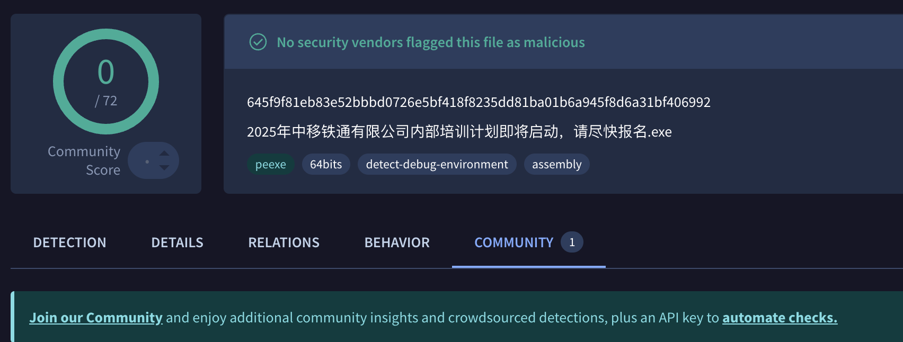

# 国护期间某通信公司的白加黑样本分析

# 投递阶段

整个技术是白加黑，伪造的文件是白的Wondershare*，*CC工具是vshell*，*这个go写的c2框架工具现在已经没有公开下载源了，git上有个叫这个的是同名的。



# drstat.dll 分析

程序有一些导出函数，但是基本是伪造合法程序命名的空导出函数，只有dr_data_stop函数有实际功能。


当合法二进制文件调用此函数时，要执行的第一个例程是 `Anti-Sandbox` 例程。在反沙箱检测中，开头和结尾是 `GetTickCount`，循环内部是一个sleep和beep方法调用，检测系统时许和声音。


反沙箱检测之后，使用 [LoadLibraryA](https://learn.microsoft.com/en-us/windows/win32/api/libloaderapi/nf-libloaderapi-loadlibrarya) 和 [GetProcAddress](https://learn.microsoft.com/en-us/windows/win32/api/libloaderapi/nf-libloaderapi-getprocaddress) 启动动态 API 加载例程，下面的动态API技术也是标准的栈字符串隐藏的方法：


API列表：

- [VirtualAllocExNuma](https://learn.microsoft.com/en-us/windows/win32/api/memoryapi/nf-memoryapi-virtualallocexnuma);
- [VirtualProtect](https://learn.microsoft.com/en-us/windows/win32/api/memoryapi/nf-memoryapi-virtualprotect);
- [EnumCalendarInfoA](https://learn.microsoft.com/en-us/windows/win32/api/winnls/nf-winnls-enumcalendarinfoa);
- [SystemFunction036 (RtlGenRandom)](https://learn.microsoft.com/en-us/windows/win32/api/ntsecapi/nf-ntsecapi-rtlgenrandom);
- [HeapAlloc](https://learn.microsoft.com/en-us/windows/win32/api/heapapi/nf-heapapi-heapalloc);
- [HeapFree](https://learn.microsoft.com/en-us/windows/win32/api/heapapi/nf-heapapi-heapfree);
- [RtlIpv4StringToAddressA](https://learn.microsoft.com/en-us/windows/win32/api/ip2string/nf-ip2string-rtlipv4stringtoaddressa).

程序的二进制文件里面还有一堆形如IPv4的字符串，其实实际动态加载是加密的shellcode。


这不是一种新的混淆方法，但也不常见。shellcode 的每个字节（十六进制）都可以由 IPv4 地址的八位字节表示。程序下一步使用 *RtlIpv4StringToAddressA* API把IPv4进行聚合然后转换成字节：


对 *Shellcode* 进行反混淆还原后，程序对每个字节进行 **XOR** 运算，并使用密钥 **0x6f**，目的是解密之前混淆的 *Shellcode*。


可以写个简单脚本还原一下：

```python
**import ipaddress

ip_list = """63.55.255.255
...**
71.39.228.27
75.95.39.228
19.75.87.39
236.171.127.46
49.172.163.163
163.0.0.0""".strip().split('\n')

XOR_KEY = 0x6f
output_file = "shellcode_payload.sc"

with open(output_file, 'wb') as f:
    for ip in ip_list:
        try:
            ip_bytes = ipaddress.IPv4Address(ip.strip()).packed
            decoded = bytes(b ^ XOR_KEY for b in ip_bytes)
            f.write(decoded)
        except:
            pass

print(f" {output_file}")
```

程序使用EnumCalendarInfoA回调函数来执行shellcode，程序分配了一个内存空间，并通过 `VirtualProtect`  将保护更改为 `PAGE_EXECUTE_READWRITE` 权限，在这个空间中，它将 Shellcode 地址作为 `EnumCalendarInfoA` API 调用的第一个 参数。API 将执行第一个参数 `lpCalInfoEnumProc` 中给定的地址中存在的代码


目前如果不带栈回溯的EDR，基本检测不出来这个IOA，除非每一个回调函数都放一个Hook。

# Shellcode分析（Vshell）

shellcode依旧是标准的artifact框架的API寻址方式，要执行的第一个作是通过 *PEB* 访问内存结构来收集 *kernel32.dll* DLL。


通过收集 *kernel32.dll* 的地址，*Shellcode* 对 [LoadLibraryA](https://learn.microsoft.com/en-us/windows/win32/api/libloaderapi/nf-libloaderapi-loadlibrarya) API 进行去哈希处理，该 API 将用于加载其他 DLL。DLL 名称被放置在 *Stack Strings* 中，目的是逃避检测。


哈希算法很简单，基于 *ROR13* 算法，如下所示：


Shellcode 将使用 *WinSocket* 库与其CC服务器进行通信。下面我们可以看到网络通信设置：

- [`WSAStartup`](https://learn.microsoft.com/en-us/windows/win32/api/winsock/nf-winsock-wsastartup) – Initialize Winsock
- [`WSASocketA`](https://learn.microsoft.com/en-us/windows/win32/api/winsock2/nf-winsock2-wsasocketa) – Create socket
- [`connect`](https://learn.microsoft.com/en-us/windows/win32/api/winsock2/nf-winsock2-connect) – Establish connection
- [`send`](https://learn.microsoft.com/en-us/windows/win32/api/winsock2/nf-winsock2-send) – Send data
- [`recv`](https://learn.microsoft.com/en-us/windows/win32/api/winsock/nf-winsock-recv) – Receive data
- [`closesocket`](https://learn.microsoft.com/en-us/windows/win32/api/winsock2/nf-winsock2-closesocket) – Clean up socket
- [`gethostbyname`](https://learn.microsoft.com/en-us/windows/win32/api/winsock/nf-winsock-gethostbyname) / [`inet_addr`](https://learn.microsoft.com/en-us/windows/win32/api/winsock2/nf-winsock2-inet_addr) – DNS resolution

下面我们可以看到如何使用 [WSAStartup](https://learn.microsoft.com/en-us/windows/win32/api/winsock/nf-winsock-wsastartup) 来启动套接字初始化过程。


socket 设置，你可以看到 Shellcode 将使用 TCP 协议来建立连接。


cc服务器的 IP 地址通过堆栈字符串进行硬编码，如下图所示，为 `62.234.24.38`。


shellcode里面有一部分代码，实现和CC的持久性


Shellcode 能够从命令和控制服务器接收加密数据，通过带有密钥 `0x99` 的简单 `XOR` 算法对其进行解密，然后在具有 `PAGE_EXECUTE_READWRITE`  权限的先前分配的地址执行它。


# vshell框架确认与分析

上一阶段主要建立连接，实际没有CC的具体命令控制，可以理解成一个loader，通过实验室阶段捕捉的所有加载阶段流量包：


发现CC段发送了有近5MB的加密流量，


前文提到带有密钥 **0x99** 的 XOR 运算获得了解密算法的逻辑，解密之后是一个压缩包，通过解压后，发现二阶段样本。


程序疑似使用的amd64这个包 来构造的反弹shell。

他的所有功能，比如数据连接发送，都是通过WinSock库。


# 简单溯源

分析几个同类样本，有一个IP虽然是海外地址，挂着的还有vps广告


