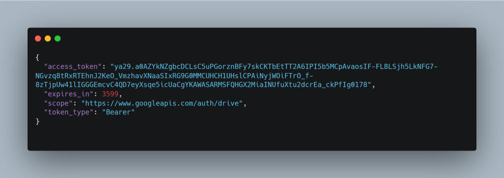

## 引言
最近实验室的APT团队最近发现了一项名为“天鹅向量”的攻击活动，该活动主要针对中国台湾和日本的教育机构和机械工程行业。攻击者利用虚假简历作为诱饵，通过复杂的多阶段恶意软件生态系统实施攻击。本文将详细介绍该攻击活动的技术细节，从恶意LNK文件到多种DLL植入物，再到最终的shellcode分析。

本次活动涉及的整个恶意软件生态系统总共包括四个阶段，第一个阶段是**恶意 LNK**，第二个阶段涉及通过非常知名的 LOLBin 执行 **DLL 植入 Pterois** 的快捷方式文件。它使用隐蔽的方法来执行和下载包含多个文件的第三阶段，包括合法的 Windows 可执行文件，该可执行文件进一步用于通过 DLL 旁加载执行另一个植入物 **Ïsurus**。这进一步执行了第四阶段，即 Pterois 下载的恶意 **Cobalt Strike shellcode**。

## 初始发现
2025年4月，团队发现了一个名为“歐買尬⾦流問題資料_20250413 (6).rar”的恶意ZIP文件，该文件名可翻译为“2025年4月13日的‘哦买尬金流问题资料’”。该ZIP文件包含多个文件，其中包括一个LNK文件和一个扩展名为PNG的文件。其中，LNK文件名为“詳細記載提領延遲問題及相關交易紀錄.pdf.lnk”，翻译为“详细记录提款延迟问题及相关交易记录”，其实际作用是运行一个伪装成PNG文件的DLL负载，该负载通过RunDLL32.exe执行，进一步下载其他植入物和一个PDF文件作为诱饵。


## 诱饵文件
诱饵文件名为“rirekisho2025”，意为“2025年简历”，是一个典型的日式简历模板。该文件包含个人信息、教育背景和工作经历等字段，格式为日语，日期采用令和年号格式（令和5年4月）。该文件被存储在临时目录中，用于迷惑受害者，掩盖恶意软件的活动。


## 感染链与技术分析


### 第一阶段：恶意LNK脚本
该LNK文件创建于2025年3月4日，其主要功能是调用RunDLL32.exe来执行名为Pterois的恶意DLL植入物。Pterois通过一个特殊的参数“1LwalLoUdSinfGqYUx8vBCJ3Kqq_LCxIg”启动，该参数在后续的攻击过程中起到关键作用。


调用的执行dll导出函数名称为Trpo。

### 第二阶段：Pterois恶意植入物
Pterois是一个伪装成PNG文件的DLL植入物，其主要功能包括API哈希解析和下载下一阶段恶意软件。该植入物通过访问进程环境块（PEB）获取已加载模块列表，利用SDBM哈希算法解析API函数地址，并通过OAuth认证与Google Drive进行交互，下载恶意文件和配置文件。

Pterois还采用了一种伪反分析技术，通过创建计时器对象加载DLL，进一步隐藏其恶意行为。完成任务后，Pterois会通过延迟执行的方式删除自身，以减少被检测到的可能性。

最初，在检查恶意 RAR 存档以及恶意 LNK 文件时，我们发现了另一个扩展名为 .PNG 的文件，称为 Chen_YiChun.png 。


在进行一些初步分析后，我们发现该文件基本上是一个 DLL 植入程序，我们将其称为 **_Pterois_**。现在，让我们检查一下这种植入物的技术细节。

DLL 文件的导出函数 Trpo：


从植入物的功能来看，它有两个主要功能，一是执行 API 哈希，后用于下载下一阶段的恶意软件。第一个函数负责解析 DLL 中的所有 API，如 NTDLL、UCRTBase、Kernel32 和其他所需的必要库，以及所需功能所需的 API。


这是通过最初访问 Process Environment Block （PEB） 来检索已加载模块的列表来完成的。然后，代码使用 InMemoryOrderModuleList 遍历此列表，其中包含链接的 LDR_DATA_TABLE_ENTRY 结构 — 每个结构都表示一个加载的 DLL。在每个 LDR_DATA_TABLE_ENTRY 中，BaseDllName 字段 （UNICODE_STRING） 仅保存 DLL 的文件名 （例如，ntdll.dll） ，而 DllBase 字段包含其在内存中的基址。非常标准的寻址方式。

在遍历过程中，该函数**将 BaseDllName 转换为 ANSI 字符串，通过转换为_大写_来对其进行规范化** ，并计算结果字符串的不区分大小写的 SDBM 哈希。此计算的哈希值将与提供给函数的目标哈希值进行比较。如果找到匹配项，则从 DllBase 字段获取相应的 DLL 基址并返回。


现在，一旦返回 DLL 的基址，代码就会使用类似的不区分大小写的 SDBM 哈希算法来解析 NTDLL.DLL 中的 API 函数地址。它通过解析 DLL 的导出表，计算每个导出函数名称的 **SDBM 哈希**值，并将其与目标哈希值进行比较以查找匹配的函数地址来实现此目的。

下面是一个简单的 python 脚本，用于执行哈希：


同样，其他两个 dynamicalliy 链接库 ucrtbase.dll 和 Kernel32.dll 的 API 正在以同样的方式解析。


在下一组函数中，它尝试从 Iphlapi.dll、shell32.dll 和 WinHTTP.dll 等 DLL 解析 API，它最初解析 DLL 的基址，就像前面的函数一样。返回后，它将使用一种简单但伪反分析的技术，该技术使用 Timer 对象加载上述 DLL。


最初，它使用 RtlCreateTimerQueue 创建一个计时器对象，创建 Timer 对象后，使用另一个 API RtlCreateTimer 运行回调函数，在本例中为 LoadLibraryW API，进一步用于加载 DLL。


然后，GetModuleHandleW 用于获取 IPHLAPI.DLL 的句柄。因此，一旦成功，RtlDeleteTimerQueue API 将用于删除和释放 Timer 对象。然后，最后通过哈希解析 API GetAdaptersInfo。


同样，其他 DLL 也以相同的方式加载。接下来，我们将研究 implant 的后半部分，即负责下载 Next stager 的函数集。

该函数首先获取由 LOLBin 和参数组成的整个命令行参数，然后被截断为 1LwalLoUdSinfGqYUx8vBCJ3Kqq_LCxIg 基本上是一个硬编码的文件 ID。


然后，它使用一种技术滥用 **Google Drive 作为命令和控制服务器** ，首先使用合法的 **OAuth 凭据**建立身份验证。通过格式正确的 OAuth 交换获得有效的访问令牌后，它使用 Google Drive API 从特定的硬编码文件 ID 中检索文件，包括恶意可执行文件、DLL 和配置文件，并将其下载到 C：\Windows\Temp 中的预定路径。


然后，它将适当的 Content-Type 标头设置为“application/x-www-form-urlencoded”，以确保 Google 的身份验证服务器正确处理请求。在此交换之后，它会执行精确的 JSON 解析功能，其中它使用 cJSON_GetObjectItem 从 Google 的响应中提取“access_token”字段。查看内存转储清楚地显示获取的以“ya29.a0AZYk”开头的 OAuth 令牌，确认身份验证过程成功。解析并提取此令牌后，它会被仔细存储，随后用于授权对 Google Drive 的 API 调用，从而允许植入程序下载其他有效负载，同时显示为来自 Google Drive 的合法流量。从内存中提取的解析后的 JSON 如下所示。


现在，一旦文件被下载，这个植入程序的另一部分就会使用 CreateThread 来生成这些下载的诱饵和其他文件来执行。


最后，下载这些文件，并在屏幕上生成诱饵，Pterois 植入物的任务就完成了。自删除...


### 第三阶段：Isurus恶意植入物
Pterois下载的文件中包含一个名为PrintDialog.dll的恶意DLL植入物（Isurus）。该植入物利用DLL侧载技术，通过与PrintDialog.exe同目录下的位置优势，运行其恶意功能。

Isurus通过PEB遍历和CRC32哈希算法解析API，从ra.ini文件中提取并执行加密的shellcode。该shellcode采用基于syscall的执行技术，直接在内存中运行，无需依赖高级Windows API函数。


之前的植入程序总共下载了四个样本。其中之一是合法的 Windows 签名二进制文件，称为 PrintDialog.exe。


现在，另一个文件 PrintDialog.dll 编译时间戳为 2025-04-08 03：02：59 UTC 的另一个植入程序，负责运行 ra.ini 文件中存在的 shellcode 内容，滥用了一种非常著名的技术，称为 **_DLL 旁加载_** ，通过将恶意 DLL 放置在当前目录中 PrintDialog.exe 因为它没有明确提及路径，并且我们称为 Isurus 的这个植入程序执行恶意任务。

查看导出表，我们可以看到恶意植入程序只导出两个函数，其中一个是普通的 DllEntryPoint，另一个是恶意的 DllGetActivationFactory 导出函数。


查看导出函数内部，我们可以看到这个 Isurus 通过哈希执行 API 解析以及 shellcode 提取，并在内存中加载和执行 shellcode。


植入程序最初通过执行 **PEB 遍历技术**来解析 API，遍历**进程环境块 （PEB）** 以查找所需 DLL（如 ntdll.dll 和 kernel32.dll）的基址。确定目标 DLL 的基址后，植入程序将继续手动解析 DLL 的 **PE（可移植可执行文件）** 标头，以查找**导出目录表** 。现在，为了解析特定的 API，植入物采用了**一种哈希算法** – **CRC32。** 加载程序不是按名称查找导出，而是计算导出表中每个函数名称的哈希值，并将其与嵌入在代码中的预计算常量进行比较，以最终解析哈希值。


比较常规的手法。

### 第四阶段：Cobalt Strike信标
最终阶段的shellcode是一个加密的Cobalt Strike信标。该信标配置了多个进程注入目标和C2服务器地址，通过HTTPS协议与攻击者控制的服务器进行通信。


## 基础设施与狩猎
攻击者利用Google Drive作为C2框架，泄露了敏感的API密钥和相关账户信息。研究人员发现了攻击者Google Drive账户的详细信息，包括用户名、照片链接和电子邮件地址。此外，还发现了多个尚未在野外使用过的恶意文件，这些文件可能被用于未来的攻击活动。

```
Process Injection Targets:

windir\syswow64\bootcfg.exe

windir\sysnative\bootcfg.exe

Infrastructural information:

hxxps://52.199.49.4:7284/jquery-3.3.1.min.js

hxxps://52.199.49.4:7284/jquery-3.3.2.min.js

Request Body :

GET /jquery-3.3.1.min.js HTTP/1.1

Host: 52.199.49.4:7284

User-Agent: Mozilla/5.0 (X11; Linux x86_64) AppleWebKit/537.36 (KHTML, like Gecko) Chrome/80.0.3987.122 Safari/537.36

Accept: text/html,application/xhtml+xml,application/xml;q=0.9,*/*;q=0.8

Referer: http://code.jquery.com/

Accept-Encoding: gzip, deflate

Cookie: __cfduid=dT98nN_EYDF96RONtS1uMjE0IZIWy9GljNoWh6rXhEndZDFhNo_Ha4AmFQKcUn9C4ZUUqLTAI6-6HUu3jA-WcnuttiUnceIu3FbAlBPitw52PirDxM_nP460iXUlVqW6Lvv__Wr3k09xnyWZN4besu1gVlk3JWS2hX_yt5EioqY

Connection: Keep-Alive

Cache-Control: no-cache

HTTP Settings GET Hash:

52407f3c97939e9c8735462df5f7457d

HTTP Settings POST Hash:

7c48240b065248a8e23eb02a44bc910a
```

```
{  “user”: {    “kind”: “drive#user”,    “displayName”: “Swsanavector56”,    “photoLink”: “https://lh3.googleusercontent.com/a/ACg8ocKiv7cWvdPxivqyPdYB70M1QTLrTsWUb-QHii8yNv60kYx8eA=s64”,    “me”: true,    “permissionId”: “09484302754176848006”,    “emailAddress”: “[[email protected]](https://malware.news/cdn-cgi/l/email-protection)”  }}
```

我们还观察到，此主机地址被用于 Cobalt-Strike 以 ASN **16509** 托管，IP 位置在日本。


## 归因分析
尽管归因始终是APT分析中的关键挑战，但研究人员发现“天鹅向量”攻击活动与Winnti APT组织和Lazarus组织的攻击手法存在相似之处，尤其是在DLL侧载技术的使用上。结合语言分析、植入物成熟度和其他收集到的证据，研究人员以中等置信度将此次攻击归因于东亚地区的威胁行为者。

## 结论
“天鹅向量”APT攻击活动自2024年12月开始活跃，主要针对台湾和日本的招聘相关实体。攻击者依赖于自定义开发的植入物，包括下载器、shellcode加载器和Cobalt Strike信标，并通过API哈希、直接系统调用、函数回调、DLL侧载和自删除等技术手段规避检测。

研究人员预测，攻击者可能会在未来攻击中继续使用DLL侧载技术，针对Python、WMI性能适配器服务和OneDrive启动器等应用程序执行恶意Cobalt Strike信标，并利用简历作为诱饵。

## IOCs（入侵指标）
### 诱饵文件（PDF）
- **文件名**：rirekisho2021_01.pdf  
  **SHA-256**：8710683d2ec2d04449b821a85b6ccd6b5cb874414fd4684702f88972a9d4cfdd  
- **文件名**：rirekisho2025.pdf  
  **SHA-256**：8710683d2ec2d04449b821a85b6ccd6b5cb874414fd4684702f88972a9d4cfdd  

### IP/域名
- **IP**：52.199.49.4:7284  

### 恶意植入物
- **文件名**：wbemcomn.dll  
  **SHA-256**：c7b9ae61046eed01651a72afe7a31de088056f1c1430b368b1acda0b58299e28  
- **文件名**：LoggingPlatform.dll  
  **SHA-256**：9df9bb3c13e4d20a83b0ac453e6a2908b77fc2bf841761b798b903efb2d0f4f7  
- **文件名**：PrintDialog.dll  
  **SHA-256**：a9b33572237b100edf1d4c7b0a2071d68406e5931ab3957a962fcce4bfc2cc49  
- **文件名**：python310.dll  
  **SHA-256**：e1b2d0396914f84d27ef780dd6fdd8bae653d721eea523f0ade8f45ac9a10faf  
- **文件名**：Chen_YiChun.png  
  **SHA-256**：de839d6c361c7527eeaa4979b301ac408352b5b7edeb354536bd50225f19cfa5  
- **文件名**：針對提領系統與客服流程的改進建議.pdf.lnk  
  **SHA-256**：9c83faae850406df7dc991f335c049b0b6a64e12af4bf61d5fb7281ba889ca82  

### Shellcode及其他可疑文件
- **文件名**：0g9pglZr74.ini  
  **SHA-256**：9fb57a4c6576a98003de6bf441e4306f72c83f783630286758f5b468abaa105d  
- **文件名**：ra.ini  
  **SHA-256**：0f303988e5905dffc3202ad371c3d1a49bd3ea5e22da697031751a80e21a13a7  
- **文件名**：python.xml  
  **SHA-256**：c8ed52278ec00a6fbc9697661db5ffbcbe19c5ab331b182f7fd0f9f7249b589